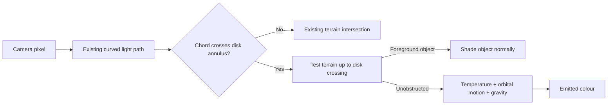

# Animated accretion disk

F4 → **Disk** controls a luminous disk around the currently selected mass-block
black hole. It is shared by OpenGL and RTX. No gas inventory or simulation is
required: enabling it assumes that a supply of hot orbiting gas exists.

## Controls

| Control | Choices | Default |
|---|---|---|
| Disk | Off / Auto: large BHs / All BHs | Auto |
| Animation | On / Off | On |
| Brightness | 50 / 100 / 200 / 400% | 100% (original 200%) |
| Outer radius | 6 / 10 / 16 horizon radii | 10 |
| Tilt from horizontal | 0 / 15 / 30 / 60 / 90° | 15° |
| Auto threshold: horizon diameter | 16 / 32 / 64 blocks | 32 |
| Glow | Off / Soft / Strong / Intense | Intense |

Under normal mass calibration, compact **7×7×7** cubes meet the default threshold.
Smaller black holes can use **All BHs**. Subcritical masses and unpaired wormhole
markers do not get disks. The disk follows the selected mass source; it does not
add another independently selected gravitational source.

Settings persist in `config/interstellar-disk.json`. Changes update uniforms;
they do not recapture terrain or rebuild RTX acceleration structures. F9 freezes
the animation clock along with the inspection view.

### Ambience

F4 → **Ambience** has independent star-density (1×/2×/3×, default2×), BH-music
and disk-gas controls. Stars extend Minecraft's deterministic star field; the
original stars remain in place. Their light contribution is 50% brighter than
vanilla, retaining time-of-day/weather fading. The captured sky now uses 1024² pixels per face
instead of 256² to retain sharper small features in lensed views.

Near a selected BH, the mod randomly chooses Minecraft's basalt-delta, crimson-
forest or End music through the ordinary music tracker. Selection stays fixed
during an approach; the next approach chooses a different music event (individual
tracks within an event are selected by Minecraft). Music volume/mute still applies. The entry distance is
8 horizon radii, clamped to24–192 blocks; a25% wider exit distance prevents
boundary chattering. Leaving or disabling the feature stops this score and
returns to ordinary music scheduling. No music assets are bundled.

The gas veil is a deliberate cinematic approximation: a warm screen blend of
at most 36%, only inside the visible disk's annulus and a layer around its
plane. The distance threshold is three times the original, ranging from 0.6 to
9 blocks according to source size. Two smooth spatial noise fields rotate at slightly different rates, so
movement encounters irregular patches rather than random whole-screen flashes.
It adds no particles, ray marches, damage or actual gas dynamics. It is drawn
below hands/HUD; Animation Off freezes its pattern. Disabling disk visibility,
mass lensing or world effects also disables the veil.

## How the image is formed

This is a surface inside the ray-traced world, rather than a circle drawn over
the image. Foreground terrain can hide it; the same bent rays reveal the far
side above the shadow and secondary images below it. Transparent foreground
materials retain their normal ordered compositing. The interior is optically
thick, with softened inner/outer radial boundaries.

The surface is an analytic plane and annulus: no triangles, gas textures,
particles or per-frame GPU geometry uploads. Each existing light-path
chord has a cheap plane test; emission is evaluated only at a disk hit. An early
disk hit can end a ray before more distant terrain work. Alpha edges can instead
require the existing material continuation pass. Performance therefore depends
on the view; a procedural disk is not automatically a net cost or a net saving.

### Cinematic glow

The owner requested a much yellower, more dramatic appearance after reviewing
the first grey/white version. The assumed peak temperature is now 4200 K with
higher display exposure. Gravitational and orbital frequency shifts still act
on that thermal spectrum; the approaching side remains hotter/brighter.

Visible disk coverage travels through the existing alpha/material pipeline.
Completed split rays carry `1 + coverage`, preserving the existing `> 0.5`
completion test; the sample fold decodes this into the image's spare alpha
channel. Ordinary terrain contributes zero. Occlusion and translucent layers
attenuate the coverage before bloom, including the disk's softened radial edges.

A bounded-resolution pass (at most 160 pixels wide, matching the image aspect)
extracts covered light with a warm golden glare tint. Exact pixel-area averaging
preserves narrow bright features when downsampling. Two separable blur passes
spread it. The existing final resolve adds the glow using compressed exposure.
Both RTX and OpenGL use this same presentation path. There are no additional
optical rays; two small RGBA16F textures are allocated while needed. At 16:9
they total about 225 KiB, including fullscreen. Glow Off skips these passes.
The blur uses contiguous 25-tap kernels rather than stretching tap spacing with
resolution: stretched taps produced repeated halos around narrow bright rings.

The golden tint is an artistic camera response, not an additional physical
Doppler shift. This is a cinematic approximation to glare, using displayed colour rather
than a calibrated HDR radiance buffer. It does not simulate scattering gas or
light up blocks. The disk can glow around a silhouette in the final image, like
camera bloom, but hidden portions do not seed it. Bright clouds, snow and the HUD
are not independent bloom sources.

## Physics and deliberate approximations

- **Nonrotating Schwarzschild black hole.** Stable circular gas orbits start at
  the ISCO, radius **3 r_s**. There is no Kerr spin or frame dragging.
- **Orbital Doppler and gravitational shifts.** Emission uses the circular
  emitter's local speed and the ray direction at its intersection. The camera
  uses the renderer's existing static-to-infall frame near the horizon. This
  produces a brighter/bluer approaching side and a dimmer/redder receding side.
- **Thin-disk temperature shape.** The zero-torque Newtonian approximation has
  `T^4 ∝ r^-3 (1 - sqrt(r_inner/r))`, peaking at `49/36 r_inner`.
  Its peak is set to **4200 K** for the requested yellow/gold display. That value
  is an assumed gas/accretion state, not something derived from Minecraft mass.
  This is not a relativistic Novikov–Thorne disk or a plasma simulation.
- **Approximate visible spectrum.** Planck radiance is sampled at 650, 550 and
  450 nm, white-balanced at 6500 K, exposed with a factor of thirty-six at the default
  brightness, then tone-mapped. Shifting temperature by
  the frequency ratio also includes spectral brightness changes; an additional
  bolometric `g^4` factor would double-count the boost. Three wavelength samples
  are a colour approximation, not integration over human colour matching curves.
- **Animation.** Filaments have differential circular orbital rates. Gentle
  smooth-noise patches change local brightness and warp the stripes. Two patch
  scales drift at 104% and 94% of the local orbital pattern rate, approximating
  moving emissivity structure rather than changing the gas velocity used for
  Doppler shifts. Noise is spatially continuous, wraps without an angular seam,
  and fades when unresolved; it is not randomly resampled each frame. A gentle
  patch-dependent shimmer varies emitted intensity by at most ±6%, smoothly on
  roughly one-to-two-second scales rather than fast strobes. Its clock uses real
  display seconds so a small hole does not flicker rapidly. Animation Off freezes
  both motion and shimmer. Smoothly
  crossfaded generations keep shear from producing indefinitely thin stripes;
  unresolved detail fades. These filaments are procedural emissivity variation,
  not magnetohydrodynamic turbulence. The display clock uses c = 60 blocks/s,
  independently of Minecraft travel speed and the relativistic sight potion.
- **Granularity and apparent depth.** Four noise scales replace predominantly
  periodic stripes. Integer-hashed lattice corners agree exactly between cells;
  quintic interpolation makes both brightness and its gradient continuous.
  The earlier floating-point sine hash gave inconsistent shared corners and
  visible wedges. Analytic gradients give hot rims/cool pockets, and a small,
  bounded view-dependent offset between emitting layers suggests parallax.
  This is an artistic emissivity/relief approximation, not solid-surface lighting
  or a gas-volume simulation. It does not change the disk silhouette, occlusion,
  orbital Doppler velocities or ray paths. Unresolved fine noise fades out.
- **No retarded-time history.** Secondary images use the current animation
  phase, not the earlier emission time for each different light path.
- **Razor-thin surface.** Exactly coplanar rays do not intersect it. There is no
  thickness, volumetric scattering, plunging gas, jet, terrain
  illumination or heat damage. Its self-emission bypasses Minecraft distance
  fog; atmosphere between disk and camera is not a radiative-transfer model.
- **Combined effects.** With wormholes, paths use the existing composed spatial
  curvature approximation; disk frequency shifts use the isolated mass model.
  With the sight potion, final RGB goes through the existing approximate RGB
  spectral postprocess. Neither combination is an exact joint spacetime/spectral
  solution.

The disk is limited by the existing loaded-source selection and 512-block view
guard. Its outer surface extends the analytic ray escape bound, not terrain
capture distance. A sufficiently large disk may surround the observer.

## References

- [NASA: the warped disk and Doppler asymmetry](https://www.nasa.gov/universe/nasa-visualization-shows-a-black-holes-warped-world/).
- [M. C. Miller: accretion disk lecture](https://pages.astro.umd.edu/~miller/teaching/astr498/lecture12.pdf), disk energetics and thermal spectra.
- [James et al.: the Interstellar renderer](https://arxiv.org/abs/1502.03808),
  a substantially more complete Kerr renderer; this implementation does not
  claim its rotating-hole physics or finite-beam treatment.

## Verification

Both normal and RTX builds pass **120 unit tests**. The ordinary jar was checked
for absence of optional Vulkan/shaderc/backend classes. Runtime shader compilation
passed in both renderers; the GPU reference fixture passed 15 disk cases, 50
observer rays and 54 colour contracts, worst error 1.64e-6. The earlier full
terrain/material fixtures also passed 52,480 optical and 156 material cases.
These are specific tests, not a claim of a fully validated astrophysical disk.

All visual checks used **Interstellar Disk QA**, a copied world. A 512-block mass
above the cloud layer, a 64-block mass, and an interior-horizon editing view were
inspected. Auto hides the small disk; All BHs enables it. Golden bloom and Glow
Off were inspected, with animation paused for matching renderer captures. The
first final-colour GL/RTX pair differed by only 0.000883/255 mean absolute RGB
error; no pixel exceeded 16/255. The broad-blur tail was then extended to remove
a visible cutoff under strong exposure. Detailed local captures/build logs are
in `run/disk-study/`.

Initial on/off runs had camera movement and are invalid. The owner later
requested a final performance comparison; the fixed-pose results below supersede
the earlier request to skip timings. Automated movement/flicker testing remains
deferred to owner feedback. Combined wormhole shader variants compile, but there
was no new complete combined-gameplay survey for this feature.

### Final refinement checks, 3 October

- Actual GPU checks: 50 observer rays, 54 colour contracts, 15 disk cases and
  30 noise-boundary checks passed; maximum numerical error1.64e-6. Full earlier
  mesh/material fixtures were also rerun successfully (52,480/156 cases).
- Final RTX/OpenGL pair: mean absolute RGB error0.000269 on the0–255 scale;
  one pixel exceeded16/255 among921,600 pixels. Local evidence:
  `run/rtx-image/compare-1791001960973/`.
- Windowed1280×720 and fullscreen2560×1440 images show no repeated glow echoes
  or sharp noise wedges. `run/disk-study/final-fullscreen.png` is the final image.
  Sharper/doubled stars and the six-tab menu were inspected. Star-density cycling
  updates the native buffer without rebuilding terrain.
- Frozen gas on/off captures at a disk-skimming camera differ by4.63 average
  RGB levels, a subtle visible change. This checks the overlay, not dynamic gas
  realism. The gas and relief models remain declared artistic approximations.
- An earlier interrupted RTX diagnostic run produced black output. Subsequent
  clean launches, renderer comparison and fullscreen resize passed with all
  temporary GPU readbacks removed. No cause for that transient was established.
  Prior user-session logs also contained fullscreen VRAM exhaustion/fallback;
  the final fullscreen check retained RTX and reported no renderer errors.

Matched live RTX camera: feet(9,345,-170), yaw0/pitch13.6; 1280×720 optical,
4×AA, fine paths, midnight, disk radius6, tilt0, brightness100%, animation off.
Each measurement uses120 warmup frames and300 samples. About5.81M terrain
triangles; the live world changed by under0.05% between sessions.

| View | Previous GPU median | Final GPU median | Previous frame interval | Final frame interval |
|---|---:|---:|---:|---:|
| Disk + intense glow |22.67ms|23.25ms|25.06ms|25.68ms|
| Disk off |31.38ms|31.87ms|33.40ms|33.50ms|

The refined texture plus higher-resolution sky costs about0.6ms /2.5% in the
disk-visible view. The disk can save traversal work by occluding distant terrain;
it is faster than disk-off at this particular camera. This is not a universal
speedup. Vulkan timestamps exclude GL appearance copies/resolve; frame intervals
include these and the unchanged cap/vsync. Local logs:
`refinement-before-runtime.log` and `ambience-runtime.log` under `run/disk-study/`.
The black-output diagnostic timings were discarded.

Developer shortcut: `gradlew checkRtxShaders -PinterstellarRtx` compiles all 16
RTX probe/material × live/frozen × optical-model programs without launching
Minecraft or creating a Vulkan device. It catches GLSL dialect errors quickly;
it does not replace runtime images, GPU maths checks or timing measurements.
