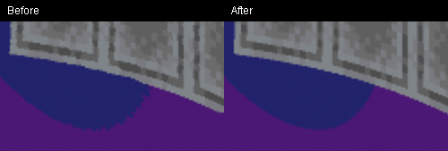

# Small-mass lens artifacts and renderer shortcut

## What the owner reported

F2 screenshots `2026-09-28_21.00.29.png`, `21.00.31.png` and `21.00.39.png`
are in `run/screenshots`. They show periodic serrations along lensed silhouettes,
especially the coloured wall. The HUD records 14 mass blocks and compactness about
0.32: an extended source, without a black-hole horizon.

That session was an **OpenGL-only launch**. Its log has no optional backend startup,
and its HUD lacks the optional renderer label. Extended masses also use OpenGL in
an RTX-enabled launch. The responsible extended-source equations have not changed
since `3bb4b67` (2026-09-23); the RTX integration did not modify them. This is a
reproduced pre-existing numerical problem, not evidence of an RTX image regression.

The reported 11–13 ms came from the GPU optical-pass timer, not necessarily complete
frame time. The accompanying sampled frame intervals were about 16.7 ms. Those
measurements should not be presented as 77–91 whole-game FPS.

## Why the silhouettes were serrated

The extended source uses a finite, regular interior metric joined to Schwarzschild
outside a spherical proxy. The radial metric is continuous at the surface, but its
derivative jumps. A conventional RK4 integration step may sample both sides of that
jump. Adjacent image rays cross at different fractions of a step, accumulating
different direction errors. A smooth silhouette consequently acquires a repeating
toothed edge. Reducing the angular step from 0.08 to 0.02 removes most of it, which
helped distinguish the integration problem from AA or output resolution.

The correction splits a ray step at the proxy surface. RK stages use one smooth
branch at a time; three Newton refinements locate the crossing angle. The conserved
null-ray relation sets the radial slope there. Subsequent chords start at that
boundary on the outgoing branch. A grazing ray that enters and exits within a
single proposed step is handled explicitly, including its short interior segment.

The interior model, AA, resolution, angular cap and ordinary black-hole equations
are unchanged. Extra work is concentrated at surface crossings. This fixes a
numerical discontinuity; it does not make the spherical mass approximation a
solution for arbitrary individual blocks.

## Shortcut correction

Previously an ordinary build interpreted Alt+F12 as a benchmark because the Alt
branch was conditional on the optional backend being enabled. In addition, modifier
state was sampled on a later client tick, so a quick Alt tap could lose its modifier.

The registered F12 binding now reads modifiers from the keyboard press event. Repeat
events do not retrigger it. Alt+F12 in a normal build explains the RTX launch flag;
it never starts a benchmark. Optional builds show a renderer preference message,
including the reason extended/near-horizon views retain OpenGL. The live HUD always
names the active renderer. Plain F12 still measures; Ctrl+Alt+F12 still compares.

Launch the optional renderer with:

```powershell
.\gradlew.bat runClient -PinterstellarRtx
```

Small extended sources retain OpenGL whichever preference is selected. An ordinary
exterior black hole is required to see a change to RTX.

## Evidence and limits

Tests use `Interstellar Visual Check 2026-09-28`, a separate copy of the owner's world.
The original `Interstellar Calibration` save is not edited. In the test copy, 14 mass
blocks have centre (3.2142857, 81.3571429, 4), radius 2.456 and compactness 0.309.
The primary camera eye is (0.4, 82.4199998856, 1.0), yaw −43°, pitch 18°.
1280×720 output uses the existing 0.5 logical scale and sharp 2× AA.

Cross-restart comparisons use a static terrain
crop because live actors and world time can change. Each final candidate/reference
pair itself is captured from the same frozen scene and frame. A finer step is a
convergence reference, not a proof of an exact image.

| Comparison against final 0.02-step reference | Mean RGB error, 0–255 | Pixels with any channel error >16 |
| --- | ---: | ---: |
| Original, static terrain crop | 1.10095 | 790 / 36,250 |
| Corrected, same crop | 0.06014 | 21 / 36,250 |
| Corrected, full same-frame pair | 0.06060 | 848 / 921,600 |

The static-crop mean error falls **94.5%**. Camera, projection, quality settings and
resolution match exactly; the comparator rejects mismatches. The crop contains no
actors or sky. The final crop was visually inspected:



A second source is an actual 2×2×2 cube (8 blocks), viewed from eye
(0.4, 81.8199998856, 1), yaw −43°, pitch 10°. Its same-frame reference comparison
has RGB MAE 0.00017870 in normalized [0,1] units, with 0.1763% of pixels differing
by more than 8/255. The contact sheet was inspected; the periodic serrations are
absent in these checked views. Tiny residual differences and ordinary pixel sampling
remain; no all-angle or exact-image claim is made.

Initial timing runs: old GPU medians 3.455/4.109 ms; corrected medians
4.523/3.910/4.554 ms. All retained approximately 8.32 ms sampled frame intervals
at the existing 120 FPS cap. These noisy GPU measurements suggest some cost for the
correction; they do **not** establish zero overhead or an uncapped FPS bound.
No performance claim for all extended-source views follows from this small case.
Final shader checks measured GPU medians 4.118/4.297 ms, frame medians
8.337/8.373 ms. Actors differ slightly after restart; these are a smoke check,
not a new controlled estimate of the overhead.

The mathematical checks compare surface-crossing angles from the angular solver
against an independent Cartesian Hamiltonian integration, across four compactnesses,
both crossing directions and three incidence angles. Grazing entry and immediate
exit have separate assertions. The existing optical tests remain in place.

Both the optional build and a clean normal build pass all **81 tests**. Runtime
shader compilation succeeds. A 20 ms Alt+F12 press in each direction switches the
optional live renderer, while the benchmark-start count stays 2→2. Normal-launch
Alt+F12 emits the explicit launch guidance. Plain F12 still completes a benchmark.

The final ordinary BH RTX/OpenGL pair has MAE 0.00220/255 and 28 pixels above16/255
out of921,600, with tiny localized differences (not pixel identity). This is a
different view from the previous RTX report, not a before/after regression series.
RTX live frame median is8.338ms, at the unchanged120FPS cap; Vulkan update/render
GPU1.605ms excludes GL appearance copies/resolve. Black-hole equations were unchanged.

Evidence: [images, metadata and raw timings](profiles/2026-09-28-lens-boundary).
Reproduce the principal comparison with the JDK-only tool:

```powershell
java tools/LensBoundaryEvidence.java docs/profiles/2026-09-28-lens-boundary/before docs/profiles/2026-09-28-lens-boundary/after docs/profiles/2026-09-28-lens-boundary
java tools/CompareAppearance.java docs/profiles/2026-09-28-lens-boundary/eight-blocks
```

Test client closed normally and original options restored. The original world's
level.dat and session.lock timestamps remain21:10:27 and21:08:54; it was not opened
for these tests. The copied world retains its original display name; its launch
argument and distinct save-directory timestamps establish the actual test target.

Automated movement/flicker checks remain deferred at the owner's request.
