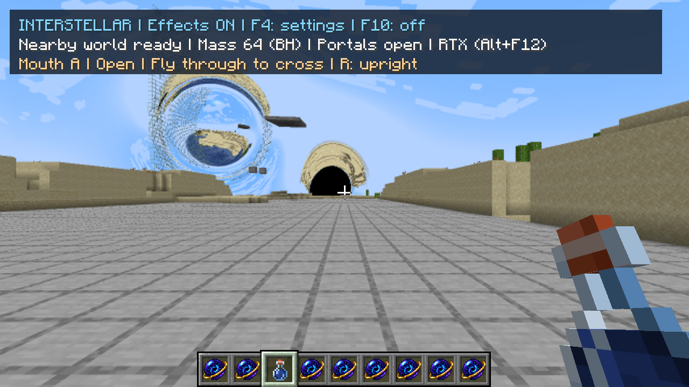
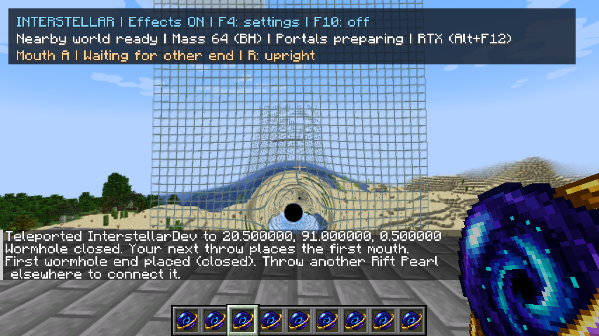
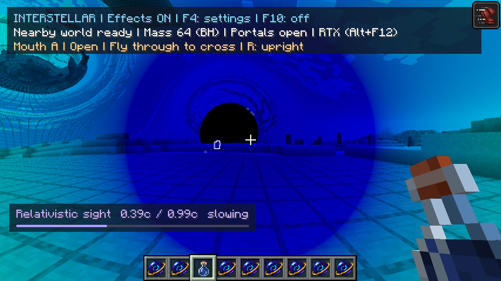

# Final bug bash and gameplay assessment — 30 September 2026

> Historical implementation report or proposal. Results, defaults and pending work describe the recorded checkpoint, not necessarily the current mod. See the [current guides and status](README.md).

## Verdict

The core features work together well enough for a controlled demo and creative
exploration. Building a mass, opening a passage, and drinking the walking potion
all produce visible feedback without manual inspection. The main remaining
gameplay work is interaction clarity and presentation, rather than another
graphics feature.

This assessment uses actual client inputs, screenshots, state queries and logs.
It is a short single-player QA session, not a claim that every Minecraft mechanic,
GPU, resource pack or multiplayer configuration is supported.

## Bug found and fixed: unnecessary pauses when reducing AA

Changing RTX from 8x AA to a lower setting rebuilt the Vulkan backend: resident
terrain acceleration structures, shared textures and all optical pipelines.
The original log shows roughly three seconds between the lower-AA request and
backend readiness. The existing output already had enough room for fewer samples.

Reuse that capacity until the requested sample count exceeds it, the resolution
changes, or the backend is otherwise closed. The shader dispatch and resolve still
use the requested sample count; this does not secretly keep tracing at higher AA.
No OpenGL rendering behavior changes.

Tradeoff: keep the largest sample buffer used during the backend's lifetime.
At this test's 640×360 optical resolution, retaining 8x instead of 4x uses about
14 MiB more output storage. Closing/recreating the backend releases it. Increasing
beyond capacity and changing resolution can still incur setup pauses; eliminating
those requires separating buffer resizing from backend creation.

The fixed build ran **4x → 8x → Off → Edge → 2x → 4x**. Exactly one backend
initialization occurred, for the initial capacity increase to 8x; the lower-AA
changes reused it. Same-frame RTX/OpenGL comparisons at 1280×720:

| Requested AA with an 8x-capacity buffer | RGB mean absolute error / 255 | Pixels with max channel error >16 |
|---|---:|---:|
| 8x | 0.00283 | 0 |
| Off | 0.00321 | 44 |
| 2x | 0.00367 | 33 |
| 4x | 0.00331 | 24 |

The errors are sparse backend edge differences, not a shifted or stale sample
image. The final 4x result was visually inspected. Both builds pass **117 tests**
with zero failures/errors/skips; the normal jar excludes the optional backend.
No source shader changes or additional steady-frame work were introduced.

## Checks performed

Only **Interstellar Final QA**, copied from the previous QA fixture, was edited.
The initial pass used the pushed refresh implementation, followed by a restart
with the small AA-capacity correction.

| Area | Result and evidence |
|---|---|
| World entry | Local preparation completed automatically in 18.04 seconds after vanilla loading. Remote portal preparation continued; no F10 needed. |
| Automatic masses | Removed the source, created eight blocks, rebuilt 64 blocks, then made a larger source. Logs confirm extended lens → BH changes without terrain recapture or manual selection. |
| Horizon editing | Built a hollow 208-block source. Native mining changed it to 207 and RMB replacement restored 208 while inside the horizon. Blocks remained editable; the unlit cavity was naturally very dark. |
| First portal | Actual sneak-use cleared the pair. The first thrown pearl showed a closed lensed end and “Waiting for other end”; the second connected it. |
| Opening and relocation | Percentage and black opening appearance were visible. Relocating the oldest end preserved the other end; overlap was rejected. The nearby replacement opened automatically. |
| Passage | Server-confirmed A→B and B→A crossings. R reset orientation. The mass source and portal rendering remained enabled together. |
| Graphics controls | All five AA choices, 50%/100% resolution, fine paths, F4 RTX/OpenGL selection and Alt+F12 were exercised. Explicit renderer feedback matched the selected backend. |
| Potion | Drank the actual registered potion: 2381 ticks remained at the first query. Forward and backward walking reached 0.99c; sideways movement charged it too. Stopping released the effect. |
| Potion controls/expiry | Independently toggled aberration, colour and dimming through F4. Duration later reached 68 ticks, then the effect disappeared without manual removal. |
| Gameplay gravity | Arrow acquired a nonzero lateral velocity toward the source. A sheep rose from Y=66 to 67.43 with upward velocity 0.110 blocks/tick; capture was temporarily disabled for that observation, then restored. |
| Native foreground | Held mass block, Rift Pearl and potion/bottle appeared. The potion drinking action worked. A glowing test mob remained outlined in the combined optical view. |
| Recovery | F10 off/on and F3+T during preparation recovered. Nether entry completed in 14.19 seconds, stayed on RTX, and returned to the Overworld in 18.03 seconds. Saving/relaunching restored the pair and preferences. |
| Geometry consistency | At least 4100 recent payloads matched GL readback byte-for-byte before the first resource reset. No mismatch or renderer-stop error. Combined BH/portal paired-image RGB MAE: 0.00723/255 during ongoing refresh. |

Preparation figures measure the Interstellar phase after vanilla loading. Byte
auditing was enabled, so these runs are not production FPS benchmarks. The matched
walking performance results remain in the [refresh report](incremental-refresh-2026-09-30.md).

Test setup corrections: an initial horizon teleport into a solid source pushed the
player out; the accessible cavity was then tested successfully. An injected sneak
modifier needed a tick before use. Initial crossing commands sent during RTX setup
were dropped; crossings were repeated after readiness. These are distinguished
from mod regressions. A NoAI sheep was unsuitable for a movement-based gravity
check; the successful lift used ordinary mob movement.

## Gameplay assessment

### What works

- **The construction loop is understandable.** Small masses bend scenery; a compact
  larger build develops a black centre. Automatic discovery makes experimentation
  much more natural than the earlier inspect/F10 workflow.
- **Portal state has useful feedback.** Closed, preparing and connected states are
  visually distinct. The crosshair text and percentage explain why an entrance
  cannot yet be used. Reusing a single item to move the oldest end is predictable
  once the tooltip is read.
- **The features compose.** A BH, both portal ends, live terrain, held items and the
  observer-speed effect can coexist. Toggling the renderer does not change the
  gameplay feature selection.
- **The potion is an effective exploration tool.** Movement stays manageable while
  the visual speed rises; sideways/backward walking allows looking around. The
  speed display and quick release make the state legible.
- **F4 is a usable control centre.** Graphics, gameplay forces and relativity are
  separated, and the important costly choices have tooltips. The dedicated R key
  is more convenient during traversal than opening a menu.

### Highest-value polish to consider next

| Priority | Friction | Suggested next step |
|---|---|---|
| High | Strongly bent visual targets still use Minecraft's straight interaction ray. This is a known mechanic limit, not a new regression. | Improve target feedback first: make the actual interactable block clear. Treat curved interaction/interaction through portals as a separate design decision. |
| High | Large portal radius plus projectile drop makes placement harder to predict. The tooltip helps, but does not show the eventual volume. | An optional landing/clearance preview would make ordinary placement much easier. |
| Medium | The three-line technical HUD occupies much of a 1280×720 view at automatic GUI scale. F4 can hide it, but then useful status is lost too. | A compact gameplay HUD, with detailed radius/range/backend information behind a diagnostic option. |
| Medium | The first portal's summary says “Portals preparing” while the more specific line says it needs another end. | Use “Unpaired” in the summary so waiting alone never appears sufficient. |
| Medium | Full Doppler colour can strongly recolour or darken a scene, making block identification harder. This is an intentional option. | Keep Gentle easy to find; explain Full as the more dramatic/less legible exhibit mode. Current owner preference was preserved. |
| Medium | First-time RTX setup, larger AA allocation, resolution changes and distant destinations can still pause or take time. | Improve feedback for setup that blocks input; separate output-buffer resizing from full backend setup if it becomes a common annoyance. |

These are recommendations, not an expansion of the accepted implementation scope.
The section-storage rewrite remains deferred.

## Limits and evidence

No new blocking gameplay fault was found in the exercised paths beyond the AA
setup inefficiency. Existing gaps remain: curved aiming, particles/special layers,
approximate weather, no accurate light-history body images, finite capture range,
and temporarily incomplete scenery after instant command teleports. See
[Minecraft feature coverage](minecraft-coverage.md).

This pass did not exhaustively repeat fishing/leashes, every projectile type,
rain/snow, survival death/respawn, multiplayer, shader packs or automated flicker
analysis. The previous [world-loading bug bash](world-loading-2026-09-30.md) and
[refresh checks](incremental-refresh-2026-09-30.md) remain complementary evidence.

Full local logs and backups: `run/final-bash/`. Compact evidence and selected images
are kept under `docs/profiles/2026-09-30-final-bugbash/`.

The client was saved and closed; all six owner settings files were restored
byte-for-byte. Owner worlds, `.idea` and the preserved AA work were untouched.
The final build artifact is RTX; both accepted jars are retained under
`run/final-bash/`.

