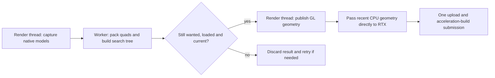
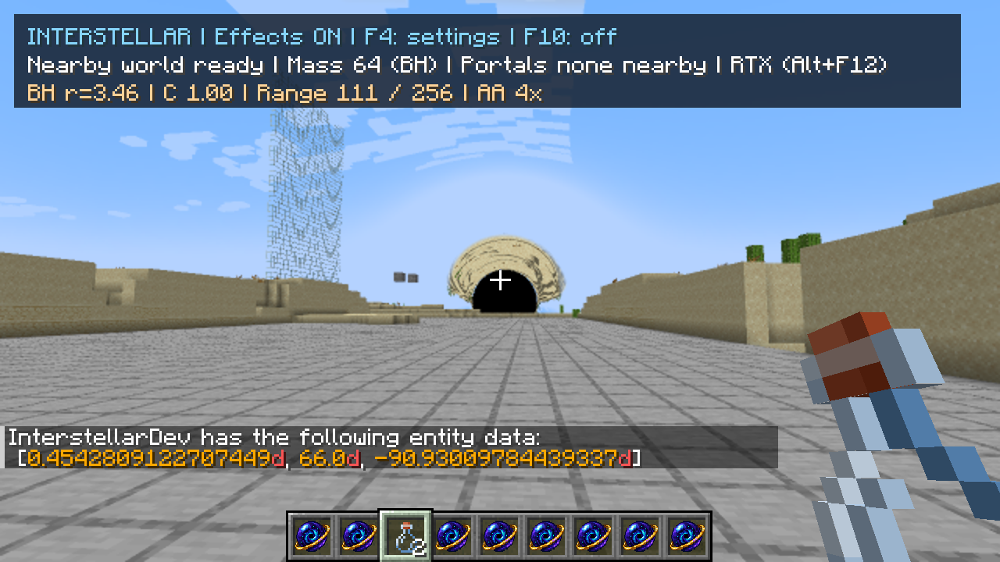
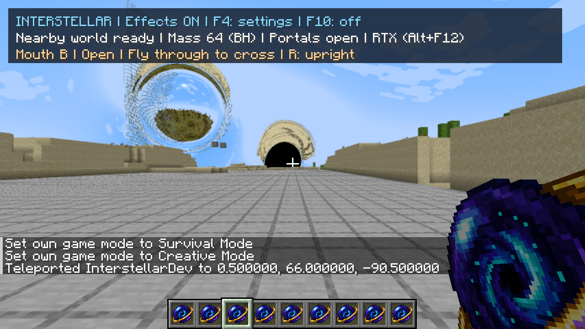
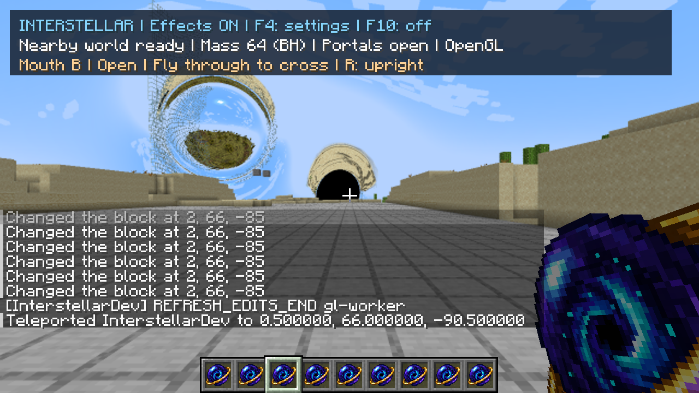

# Incremental terrain refresh experiments — 30 September 2026

> Historical implementation report or proposal. Results, defaults and pending work describe the recorded checkpoint, not necessarily the current mod. See the [current guides and status](README.md).

Status: accepted optimizations implemented and measured in both renderer variants.
Base: `37733f7`. Trial implementations are preserved in commit `35e72a8`.

## Decisions

| Proposal | Result | Reason |
|---|---|---|
| Direct CPU geometry handoff and fewer Vulkan submissions | Keep | Same-client RTX synchronization fell from roughly 1.6–1.8 ms to 0.8–0.9 ms per frame with terrain synchronization. A single bounded payload and one combined submission avoid a larger cache or GPU scheduling rewrite. |
| Coalesce lighting notifications | Reject | A short delay made no material difference to frame time, publication count or backlog on the walking route. Existing queue coalescing already absorbed most bursts. |
| Reuse RTX intersection structures when vertex positions match | Reject | SHA-256 fingerprints of ordered positions did enable reuse, but checking them cost more than the GPU build work saved: roughly 0.95–1.1 ms synchronization versus 0.8–0.9 ms. No useful frame-time gain. |
| Budget capture, publication and RTX refresh together | Reject | Mean frame time improved by doing less refresh work. The return-leg queue grew to 172 versus 155 with the worker, which achieved similar or better frame times and completed more updates. |
| Rebuild individual vertical sections | Deferred by owner | About 98% of 524 sampled walking captures followed whole-column content invalidation; only eight were lighting-only. Most native notifications covered the full height. The proposed storage rewrite would be substantial in both renderers. Editing-specific benefits remain possible. |
| Pack geometry and construct search trees on a worker | Keep | Repeated same-client trials reduced mean frame time from approximately 19.8–20.0 ms to 18.8–19.0 ms, improved slow frames and completed more updates. One bounded job; native capture and GPU access remain on the render thread. |

## What changes internally

Native model capture still uses the same 5 ms slice and the same geometry, lighting,
materials and optical shaders. Nearby edits bypass the worker to avoid an additional
frame of publication latency. Background captures use this pipeline:

The worker sees only arrays and scalar metadata. It never reads Minecraft world
state or calls a graphics API. There is at most one worker job and one active
capture. Closing the cache cancels its job and shuts down its executor. Changes to
blocks invalidate obsolete jobs before publication; leaving the capture region or
unloading a chunk also prevents publication.

A final review added an explicit invalidation when a worker's chunk leaves the
window: pruning the version map must not let a late result match a recycled version
after re-entry. This small guard was added after the timed/runtime matrix and built
in both delivery variants; the rare exact re-entry race was not forcibly reproduced.

The worker adds temporary storage for one column's raw vertices, packed vertices
and search tree alongside the active capture. It does not retain the entire world
on the CPU. It can overlap native capture on another CPU core; slower CPUs or
different workloads may see different gains. Near edits mean the camera's chunk
and its eight horizontal neighbours. Distant random edits can use the worker.

RTX subscribes to a single recent CPU payload, capped at **16 MiB**. Its chunk key
and revision must match the requested update. The existing GL readback remains the
fallback for older geometry, initial backend creation and oversized payloads.
OpenGL-only rendering does not retain this handoff payload. A transfer larger than
the existing 16 MiB staging buffer keeps the original multi-submission path.

No geometry simplification, lower ray accuracy, changed AA or reduced viewing range
is part of these changes.

## Measurement method

- Copied QA world **Interstellar Refresh QA**, derived from seed
  **-5073909985471291755**. No owner world was edited.
- 1280×720, render distance 12, optical scale 50%, fine paths, 4x AA; VSync off,
  frame cap 260. Fixed daylight and weather; ordinary world ticking continues.
- Flat lane at X=0.5, Y=66, starting Z=-90.5. Hold W for 18 seconds, then S for
  18 seconds: about 77 blocks each way, crossing several chunk boundaries.
- Start with the capture queue drained. Analyze gameplay frames excluding the
  first two seconds and last 0.3 seconds of each leg. Record actual positions.
- Alternate modes inside one warmed client, including reverse comparisons.
  The first separate-launch comparison suggested a much larger FPS gain; that
  comparison is confounded and is **not** the basis of the retained result.
- The opt-in profiler records frame intervals, capture, packing, tree construction,
  publication, readback, Vulkan transfer/build time, driver waiting and queue size.
  It adds no GPU query/readback to the normal timing path. Byte audits and paired
  screenshots are separate checks and must not be timed as production.

The figures above describe this workload, not a universal FPS improvement. GPU-bound
stationary views need not improve. Frame intervals include ordinary Minecraft work;
they are more useful here than timing only the optical shader.

## Final verification

### RTX walking

The final build ran reference / optimized / optimized / reference in one client.
The warmed final reference is the conservative comparison; the first outward leg
had a readback outlier and is not used to inflate the result.

| Mode / round | Outward mean / p95 / p99 (ms) | Return mean / p95 / p99 (ms) | Published columns, outward / return |
|---|---|---|---|
| Reference, 1 | 20.48 / 24.88 / 32.65 | 20.15 / 24.16 / 28.09 | 248 / 254 |
| Optimized, 2 | 18.69 / 21.94 / 24.09 | 18.93 / 21.75 / 24.30 | 301 / 268 |
| Optimized, 3 | 18.87 / 22.39 / 24.95 | 18.86 / 21.72 / 23.72 | 294 / 269 |
| Reference, 4 | 19.70 / 24.22 / 27.75 | 20.10 / 24.14 / 27.06 | 281 / 248 |

Averaging the two warmed reference legs and the four optimized legs gives about
**5.3% lower mean frame time (5.6% more FPS)**, **9% lower p95** and **11% lower p99**.
These are averages of per-leg statistics, not pooled percentiles. Roughly 7% more
columns were published per measured leg; peak queues were 142–165 optimized versus
153–169 in the warmed reference. The improvement did not come from withholding
terrain work. This is a short repeated experiment on one machine, not a statistical
confidence interval or a guaranteed gain for every scene.

### Geometry, editing and lifecycle

- An explicit audit compared at least **700 recent CPU payloads byte-for-byte**
  against actual GL texture readback. All matched. Audit frames are excluded from
  performance results.
- Same-frame OpenGL/RTX comparison during walking refresh: 7.07M triangles,
  66 queued columns, RGB mean absolute error **0.00172 / 255**, eight pixels with
  maximum channel difference above 16. This compares backends using the same
  published geometry; it is not a mathematical proof of worker scheduling.
- After an actual portal crossing: RGB mean absolute error **0.00199 / 255**,
  four pixels above 16, with streaming still active. Command teleporting before
  that check temporarily exposed uncaptured distant terrain, an existing limitation.
- Eight alternating nearby block edits in each mode published in **22–24 ms**
  from the received edit notification. Reference and optimized both averaged about
  23 ms. These are controlled command edits, not mouse-to-display measurements.
  The OpenGL-only combined view published its eight edit checks in 48–54 ms;
  that check has no matching unoptimized edit series, so no speedup is inferred.
- A ready portal crossed A→B; a native pearl relocated the oldest entrance.
  F10 off/on and F3+T during rebuilding recovered with the combined BH/portal view.
  No renderer-stop or worker failure occurred in these checks. Earlier entry before
  travel readiness correctly did not teleport the player.
- Inspected representative terrain, post-crossing and post-reload images. The
  native materials, sky, BH, portal and held item remained present.

### OpenGL-only and delivery

The normal client ran reference / worker / worker / reference with **no Vulkan
backend installed**. It used the same route after the relocation check had moved
one portal into the local view. This is a heavier optical workload than the RTX
walking matrix above; compare modes within this table, not FPS between tables.

| Mode / round | Outward mean / p95 / p99 (ms) | Return mean / p95 / p99 (ms) |
|---|---|---|
| Reference, 1 | 64.85 / 85.78 / 88.70 | 63.70 / 83.09 / 86.79 |
| Worker, 2 | 64.72 / 81.18 / 88.07 | 64.05 / 82.97 / 89.44 |
| Worker, 3 | 65.03 / 83.43 / 90.54 | 64.07 / 85.76 / 89.18 |
| Reference, 4 | 64.97 / 82.16 / 85.89 | 64.07 / 83.57 / 90.20 |

Warmed mean frame time is **64.52 ms reference versus 64.46 ms worker**. Slow-frame
statistics fluctuate in both directions; publication counts are essentially
unchanged (86–90 per leg). There is **no demonstrated OpenGL gain or meaningful
regression** here. A GPU-bound view cannot benefit much from overlapping CPU work.

Both delivery builds pass **117 tests**, zero failures/errors/skips. The normal
artifact contains no optional backend, Vulkan or shaderc entries. The final build
artifact is RTX; accepted normal and RTX jars are preserved locally under
`run/refresh-study/`. Owner options and Interstellar configuration are restored
byte-for-byte; the client was saved and closed. Only the copied QA world changed.
Original worlds, `.idea`, and the preserved AA work remain untouched.

Representative acceptance images:

## Reproduction and evidence

Compact summaries are in [the profile directory](profiles/2026-09-30-incremental-refresh/).
`summary-alternating.json` records direct-transfer and notification-coalescing
trials; `summary-pipeline.json` records worker, budget and fingerprint trials;
`final-rtx.json` contains only the final four timed rounds. The ignored local raw
logs, control scripts, intervals and audit output remain in `run/refresh-study/`.

Developer switches (all optimizations default on):

- `-Dinterstellar.meshWorker=false`
- `-Dinterstellar.directTerrainUpdates=false`
- `-Dinterstellar.batchTerrainUpload=false` (RTX only)
- `-Dinterstellar.refreshProfile=refresh-study/frames.csv` enables CPU/frame timing.
- With profiling, `-Dinterstellar.refreshControl=refresh-study/mode.txt` reads a
  mode once per second: `reference`, `direct batch worker`, or `default`.
- Add `audit` to an optimized control mode, or use
  `-Dinterstellar.auditDirectUpdates=true`, for the additional GL byte readback.
  Disable that audit before timing.

Analyze recorded UTC walking intervals using
`python tools/analyze-refresh.py frames.csv legs.jsonl LABEL output.json`.
Packing/tree columns measure worker wall time when asynchronous, so they can
overlap rendering and must not be summed as render-thread time. Transfer/build
timings include submission waits; no new GPU queries are added by this profiler.

No optical shaders or approximation settings changed. Multiplayer, long-duration
resource churn and low-core-count systems were not exhaustively tested. The
section-storage rewrite remains deferred at the owner's request; editing-specific
benefits are a separate question from the walking evidence here.
