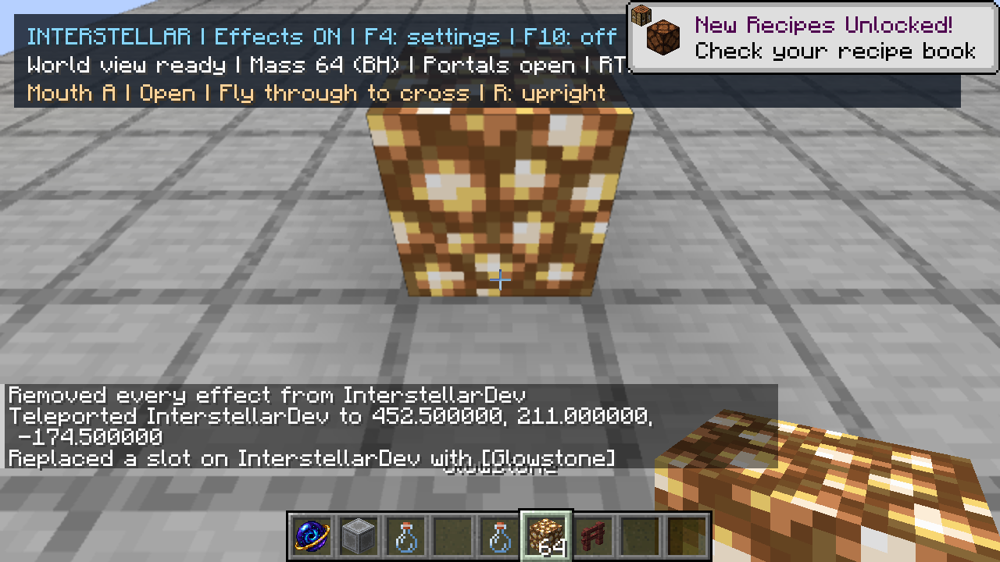
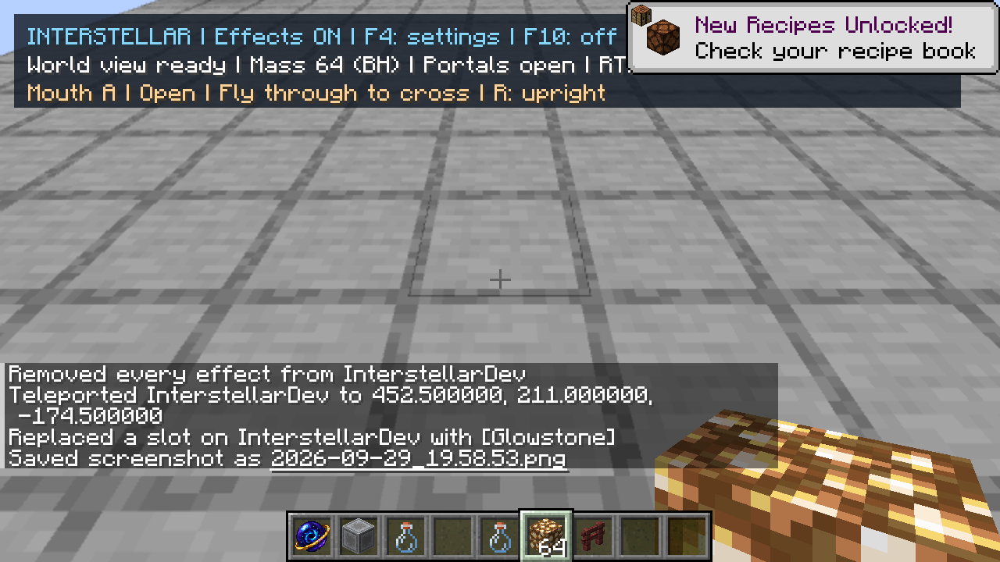
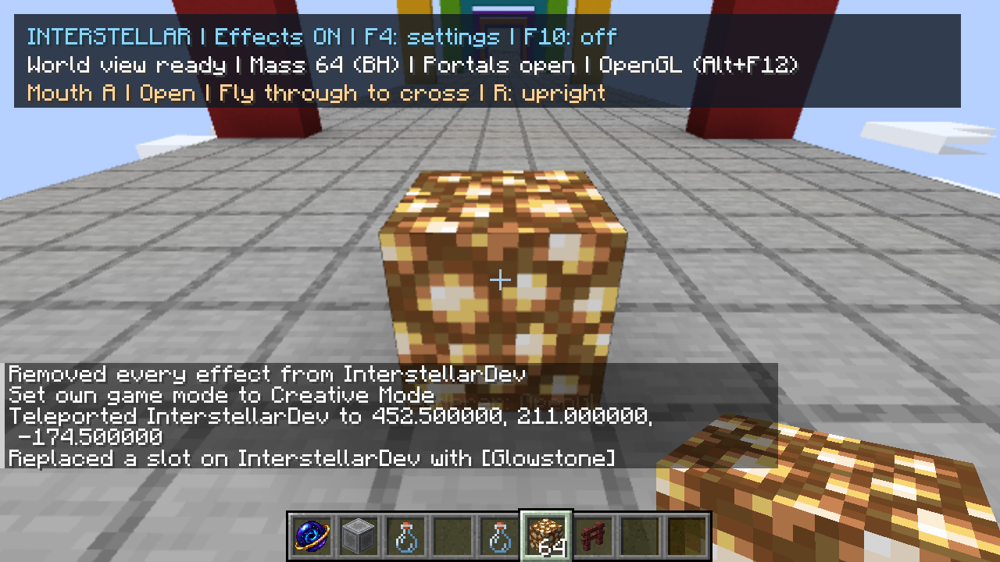
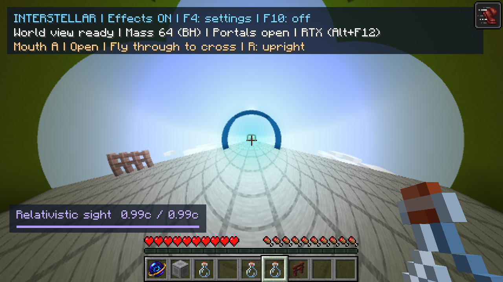

# Prompt live edits and walking-triggered Relativistic Sight

## User-visible changes

Placed/mined blocks no longer wait behind the scenery capture queue. Actual block
changes are urgent; lighting/render notifications request a follow-up without
invalidating a geometry capture already in progress. Changes to actual content
still invalidate old captures. Neighbouring chunk columns are refreshed only when
the edit touches their shared edge (including diagonal ambient-occlusion neighbours).
The existing 5 ms capture slice remains; there is no added full-world pass or draw.

Relativistic Sight now lasts **two minutes** and charges while walking in any
horizontal direction. Sprinting still works. Travel, rather than gaze, sets the
optical velocity; looking sideways/backwards is independent. Intentional movement
and actual displacement are both required, so a wall or passive push does not
charge the effect. F4 labels, item tooltip, command help and HUD were updated.
The default ramp remains 15 seconds to 0.99c; real movement speed is unchanged.

## Why edits were delayed

Previously, player edits, newly loaded scenery and lighting shared a single FIFO.
Lighting also advanced the same content version as a block edit. If it arrived
while a chunk column was being captured, the completed result was rejected and
queued again. A large background backlog compounded those retries.

`TerrainRefreshes` now tracks urgent content edits separately from lighting.
`WorldRenderer.updateBlock` provides actual old/new block states; generic
`scheduleChunkRender` requests remain redraw notifications. Chunk load/unload and
wormhole packet invalidation retain their content semantics. Both renderers consume
the same published geometry; RTX replaces the changed chunk acceleration structure.
No shader or optical equation changed.

## Acceptance checks

A new copy, `Interstellar Refresh QA 2026-09-29`, was used. Original saves were
untouched. Client saved/closed and original graphics, relativity, gravity and
fullscreen options restored. The QA copy retains the temporary test glowstone.

- Both final Gradle builds pass 114 tests. New regression cases cover urgent work
  ahead of 600 background requests, unloaded edits, lighting during capture,
  later content invalidation, coalescing, window pruning, negative chunk edges,
  W/A/S/D, passive pushes, walls, flying/gliding/swimming.
- Native right-click placement and creative mining verified in RTX with the camera
  stationary. No looking away or manual refresh was needed. Native right-click
  placement also verified in OpenGL; its camera shifted between operations, so its
  benchmark is recorded separately, not compared as an identical pose.
- Light-emitting block changes exercised negative-coordinate chunk corners. All
  affected columns published within roughly 0.5 seconds in that sequence.
- A real potion was drunk; W/A/S/D without Ctrl produced boost directions +X, -X,
  -Z and +Z while the gaze stayed forward. Walking into the placed block stopped
  charging. After removing it, normal W reached 0.99c after 15 seconds.
- Expiry was observed end-to-end with the initially requested 60-second duration:
  1178 ticks remaining just after drinking, 711 later, then no active effect.
  The owner subsequently requested **120 seconds**; the final registration uses
  2400 ticks and both builds include it. A second full timed expiry run was not
  repeated for that constant/text-only change.
- Runtime shader loading succeeded; no ERROR/Exception or shader-link failures
  were found. Existing optimized-out uniform warnings remain.
- Normal artifact checked for absence of optional Vulkan/shaderc/backend entries;
  final `build/libs/interstellar-0.1.0-dev.jar` is the RTX flavour.

### Measured edit latency

These are elapsed times from draining the client edit notification to publishing
the rebuilt chunk, not mouse-to-monitor latency. They exclude at most the incoming
frame delay and presentation; native RTX synchronization followed publication.
Diagnostics use opt-in `-Dinterstellar.traceEdits=true` and are off by default.

| Check | Background chunks at receipt | Publish latency |
|---|---:|---:|
| RTX native placement | 251 | 208.318 ms |
| RTX native mining | 241 | 197.811 ms |
| OpenGL native placement | 226 | 174.830 ms |

An unrelated current column finishes before the urgent one starts. Whole-column
capture is still incremental; this is not an instantaneous overlay or a hard
latency guarantee on arbitrary terrain, hardware or continuous edits.

### Image and timing checks

1280×720 output, 50% ray dimensions (640×360), fine paths, 2x AA; mixed mass64 and
wormhole scene. The fixed-pose edited-image pair has mean RGB error **0.000067636
/255**, RMSE 0.011615/255, 54 changed pixels and none above 16/255 max-channel error.
See [comparison.txt](comparison.txt) and the [selected runtime log](checks.txt).

| Run | View / streaming | Frame p50 / p95 | Measured render stage p50 |
|---|---|---|---|
| RTX | yaw 0°, pitch 45°, queue empty | 8.350 / 9.840 ms | Vulkan update/render 0.637 ms |
| OpenGL | yaw 2.1°, pitch 3°, background capture active | 13.457 / 15.714 ms | GL optical pass 12.751 ms |

300 samples after 120 warmup frames; frame intervals include the 120 FPS cap.
These are functional acceptance timings, **not** a before/after performance study
or an RTX/OpenGL speedup comparison. A later attempt to repeat the GL benchmark
at the prescribed pose did not receive its inputs and timed out; it supplied no
measurement. No broad movement/flicker survey was run (owner-deferred).

## Screenshots

RTX placed block, followed by the same camera after mining:

OpenGL native placement:

Normal walking at the optical cap (no sprint key):

