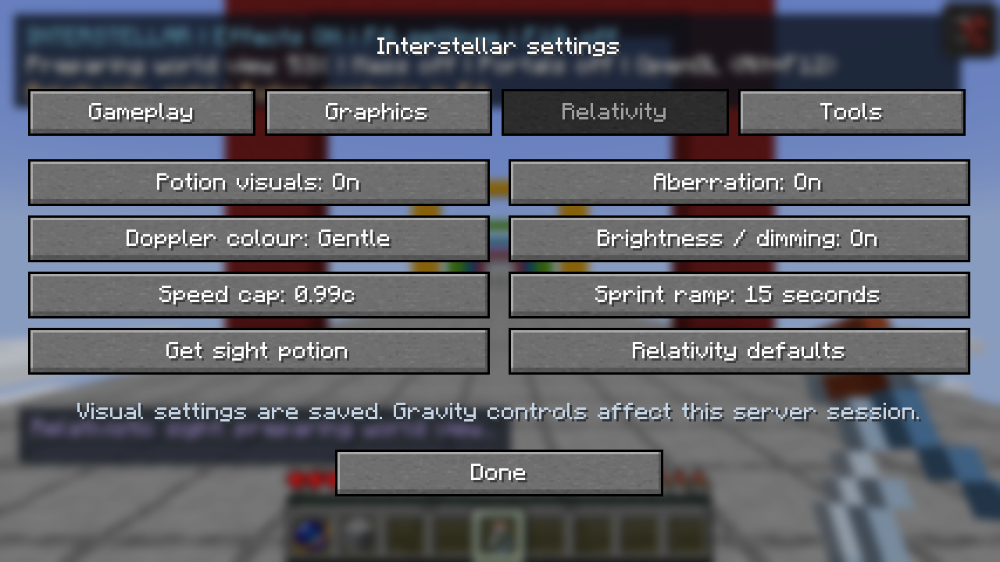
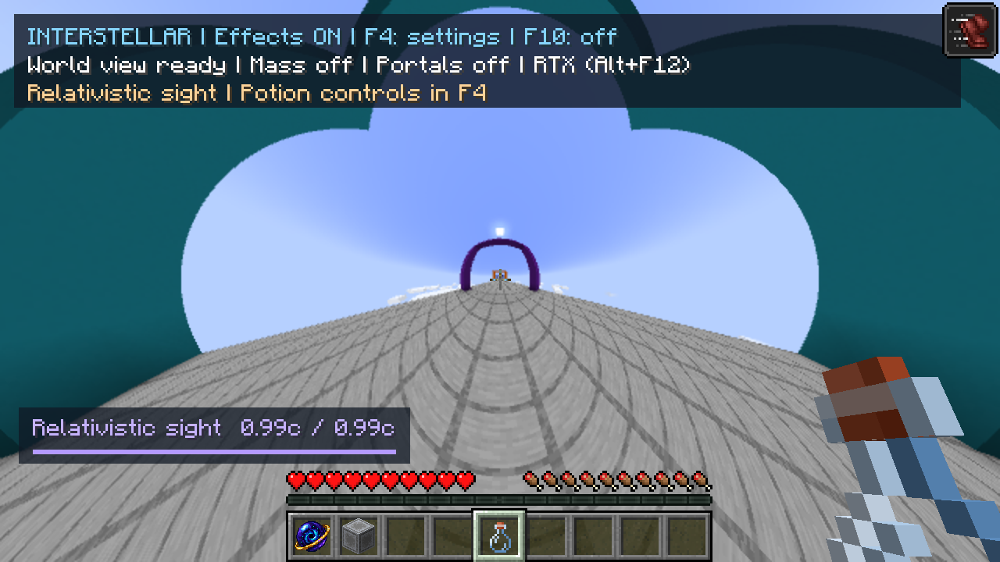
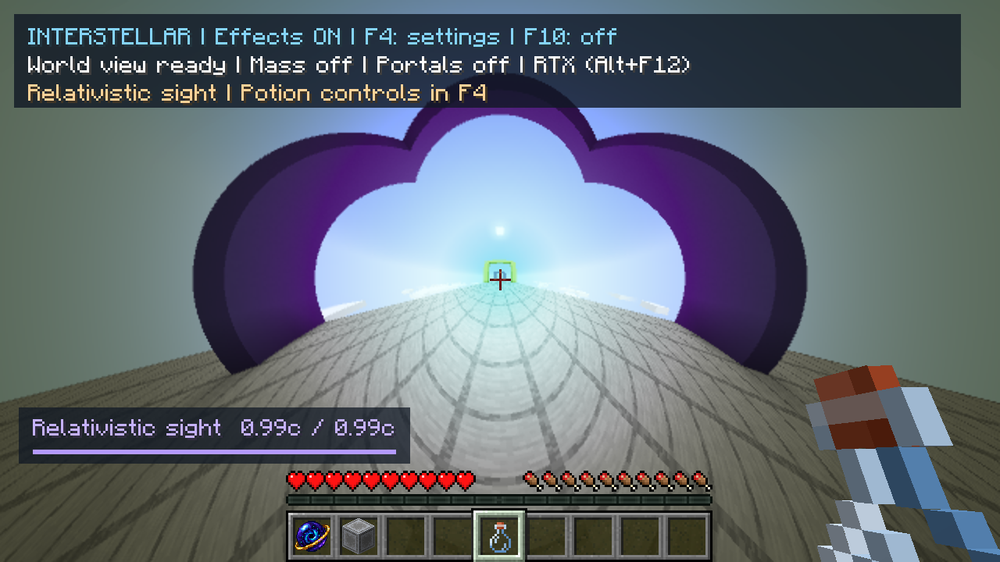
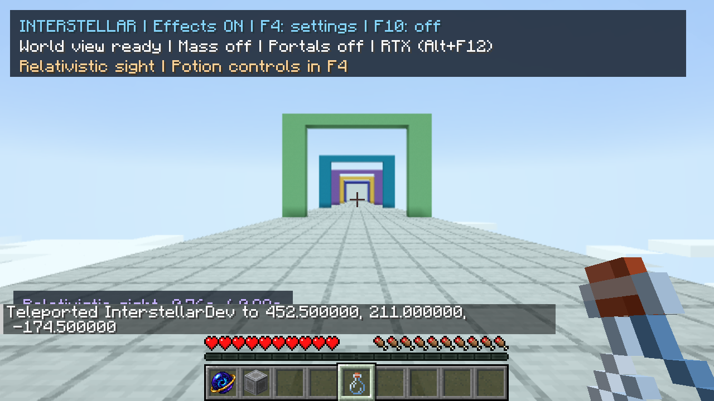
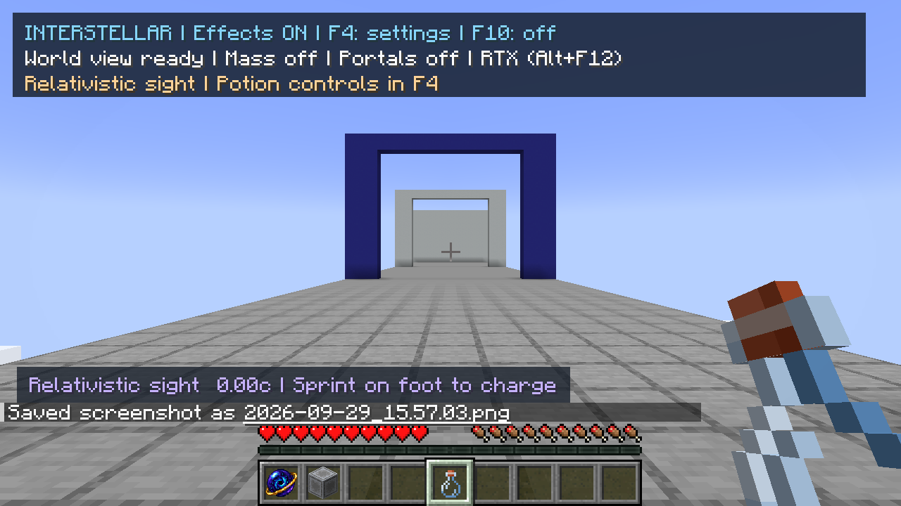
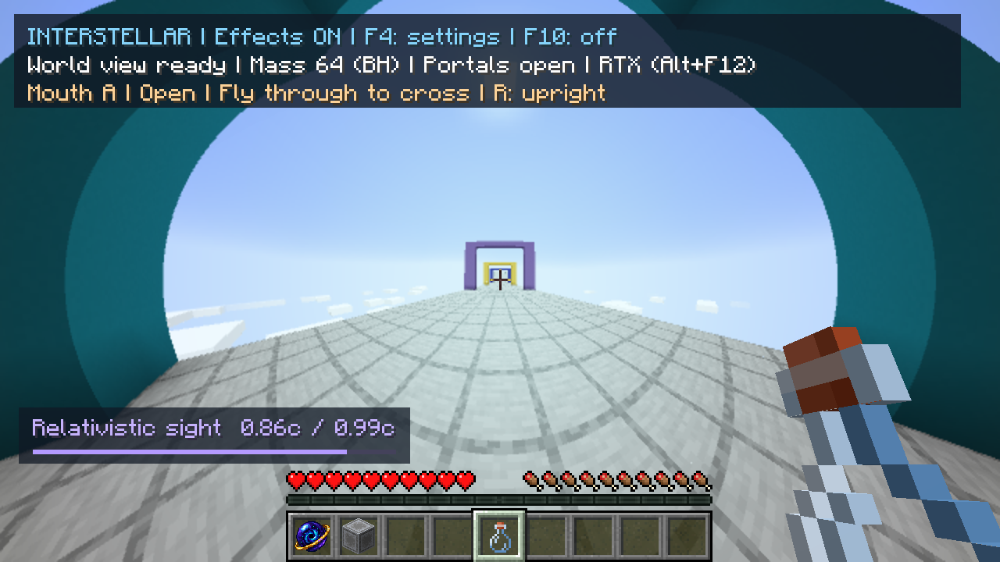

# Relativistic Sight acceptance — 29 September 2026

Scope and assumptions: [feature guide](../../relativistic-sight.md), decision D096.
All world edits and inputs used **Interstellar Relativity QA 2026-09-29**, copied
from the previous QA save. No original owner save was edited. A simple elevated
colour-gate course makes projection changes easy to recognize.

## Checks performed

- Normal and RTX Gradle builds pass, 109 CPU tests. The ordinary jar contains no
  Vulkan, shaderc or optional interop backend entries.
- Final OpenGL shaders compile/link at runtime, including the legacy voxel program.
  The acceptance launch has zero ERROR/Exception/link-failure messages. Existing
  warnings for uniforms/samplers optimized out of specialized variants remain.
- GPU observer fixture: **50 rays, maximum error 1.6369261e-6**, against an
  independent double photon four-vector boost. Covers zero through 0.99c, arbitrary
  directions, and aberration on/off. Error combines direction-vector distance and
  relative Doppler error; tolerance 1e-4. This validates local Lorentz optics,
  not spectral reconstruction or the approximate mixed gravitational metric.
- Actual potion drinking starts preparation without a source or F10. Operator
  potion command works. Creative registration, tooltip and brewing recipe compile;
  a physical brewing-stand cycle was not separately exercised.
- Held sprint reaches 0.99c; release returns the HUD and scene to zero speed.
  Holding forward into the end wall stops charging even before releasing the key;
  the final server position is z=-5.3000000119. Server movement remains vanilla.
- F4 saves separate aberration, colour and brightness settings. Tested aberration
  alone, colour/brightness without aberration, final gentle defaults, and coexistence
  with a 64-block mass and both open wormhole mouths. Backend switching and the
  same-frame comparisons exercised both OpenGL and RTX.
- World changes and restarts preserve the settings. Initial player preparation
  is visible in the HUD; idle potion-only views use the native image and skip the
  extra ray draw/dynamic capture. There is still bounded terrain-cache work.

## Image comparisons

1280×720 output, 640×360 optical target, fine paths, 2x AA. The comparison freezes
both draws to the same scene state. Streaming may still be active outside that
paired draw; this is not a temporal stability test.

| Case | Mean RGB error /255 | RMS /255 | Pixels with max channel error >16 |
|---|---:|---:|---:|
| 0.99c, aberration alone | 0.00124494 | 0.0903192 | 11 / 921,600 |
| 0.99c, final gentle colour + brightness | 0.00068613 | 0.0382307 | 0 / 921,600 |
| Sprint boost + mass + wormholes | 0.00011032 | 0.0237308 | 0 / 921,600 |

The mixed case checks shared backend output with the optics active; the course
floor obscures the mouths themselves. It is not a new independent GR solution.

## Timing observations

The synchronized comparison uses 16 repeated draws of a fixed image. Median
wall times include synchronization and resolve; they are **renderer timings,
not total gameplay frame times**.

| Case | OpenGL wall ms | RTX wall ms | RTX Vulkan GPU ms |
|---|---:|---:|---:|
| Aberration alone | 5.2373 | 0.6043 | 0.1065 |
| Final gentle defaults | 6.5670 | 0.6864 | 0.0979 |
| Mixed effects | 22.0998 | 2.1455 | 1.3000 |

A separate frozen 0.99c aberration benchmark (120 warm-up + 300 samples) measured
8.352ms median /8.780ms p95 frame intervals, near the 120 FPS cap. Vulkan update
and draw were 0.123ms median. This simple straight-ray course is not representative
of expensive close black-hole views. Different cases also have different poses
and geometry; these numbers do **not** isolate the percentage cost of Doppler
math or establish a before/after OpenGL performance regression bound.

## Bugs and visual decisions found during acceptance

1. A new global shader value triggered an NVIDIA compiler exception in the large
   legacy voxel program. Doppler evaluation is now a local, pure calculation;
   the potion's native-mesh requirement keeps SR out of that old laboratory shader.
2. The optimized world shaders bake Lensing=1. With a zero source radius, the old
   radial shortcut mistakenly classified the lower half of the view as a horizon.
   Zero radius now explicitly takes the straight-ray path and cannot form a horizon.
   The two backends agreed on that bug: paired images alone were insufficient.
3. Normalized direction interpolation could stick on a 180-degree reversal.
   Opposite directions now switch without passing through a zero vector.
4. Frozen diagnostics now respect disabled mass/portal controls and support the
   potion's source-free native scene. Existing GR fixture checks clear SR velocity.
5. An initial gentle exponent of 0.15 still created strong spectral colour bands
   at 0.99c. Visual review reduced the final gentle exponent to 0.06. Full shift
   remains 1.0 and can legitimately black out the assumed visible-only spectrum.

No automated movement/flicker survey was added (owner-deferred). Gameplay sprint
inputs here verify activation/release and the controls. Causal entity histories,
calibrated spectra and gravitational spectral transport remain unimplemented.

## Screenshots

