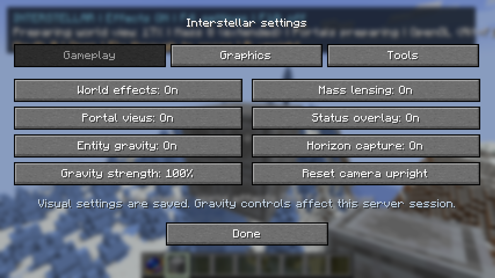
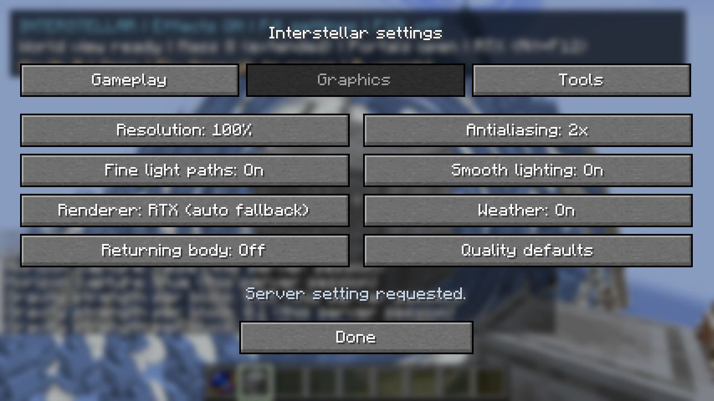
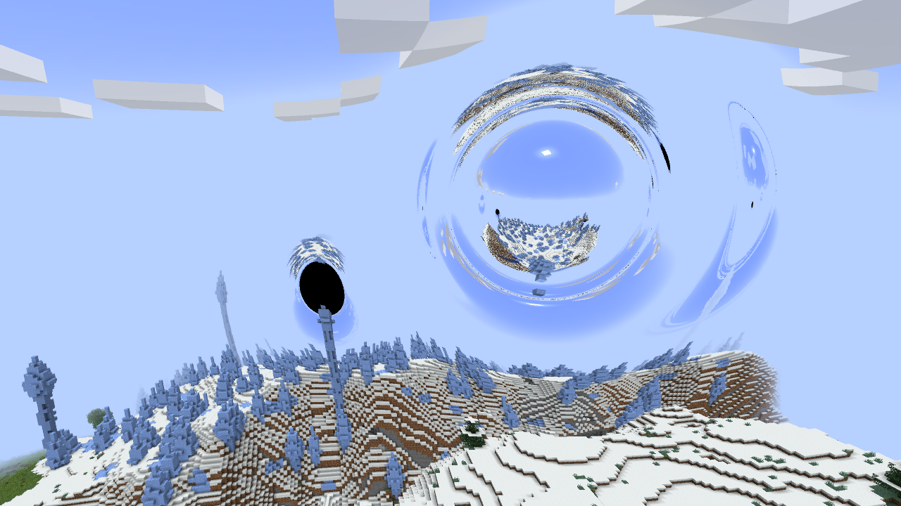
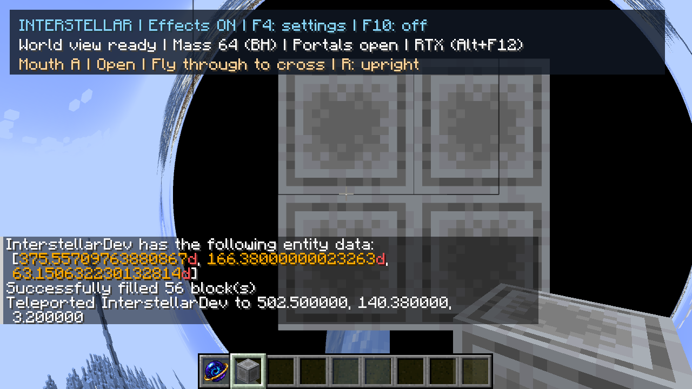

# Unified mass and wormhole gameplay — 29 September 2026

## Implementation

One live renderer now owns the automatically selected mass cluster and the placed
wormhole pair. A mixed scene traces their combined spatial curvature and tests one
native geometry cache. Single-effect scenes keep their existing solvers. Source
edits and individual feature switches update that renderer without starting a new
terrain capture. Master-off releases it deliberately.

The combined rule is an approximation, including identifying the different radial
coordinate charts. It is not an exact multi-object spacetime. Equations, cutoffs,
observer conventions and numerical method are in [science.md](../../science.md#mass-and-wormholes-in-the-same-gameplay-view-2026-09-29).

F4 exposes Gameplay, Graphics and Tools tabs. F10 is the same saved master visual
switch, defaulting on. Mass and portal visuals have independent switches; server
gravity/capture/strength are distinct, permission-checked session settings. Portal
off preserves markers and layout while suspending travel until a new visible-frame
acknowledgement. Labs restore the saved setting when closed.

## Numerical checks

105 CPU tests pass, including four new mixed-field tests: the simplified spatial
mass coefficient against metric Hamiltonian acceleration; the zero-mass limit
against the existing Cartesian wormhole reference; step convergence across an
extended body; and invariance to swapping the two mouth labels. An initial surface
convergence failure led to targeted boundary step refinement in both solvers.

The float-framebuffer GPU fixture checks 37 localized-wormhole rays and 32 mixed
rays against independent CPU trajectories. Mixed cases include zero mass, a BH,
and two finite-body configurations. It compares both outgoing direction and
capture/passage classification, with a direction tolerance of0.001. The CPU uses
fine midpoint integration and metric derivatives; GPU uses adaptive RK4 and a
simplified coefficient. This checks the implemented optical rule, not the physical
validity of combining strong fields.

Final GPU result: **69 rays, zero mismatches**, maximum outgoing direction-vector
error **0.0005831605**. Both normal and optional-RTX Gradle builds pass105 CPU tests;
the normal jar contains zero optional backend/Vulkan entries. Final logs are
`run/unified-final-normal-build.log`, `run/unified-final-rtx-build.log`, and
`run/unified-gameplay-final-optics.log`. See [selected evidence](acceptance.txt).

## Runtime and image checks

Automatic combined activation, individual mass/portal switches, server-confirmed
gravity controls, all five AA modes on RTX, F10/F4 master consistency, automatic
lab return, and portal readiness withdrawal/reacknowledgement were exercised.
Disabling portal views kept the pair and markers. Remaining inside during reopening
did not teleport the player; leaving and walking back through A crossed to B while
mass optics stayed enabled. R then reset the camera frame.

Inside the BH, a normal mouse click mined a visible mass block. The source updated
64→63 and switched to extended lensing, then returned to BH rendering when restored,
without F10 or a new terrain cache. This verifies editing behavior, not physical
visibility of matter inside a real BH.

The settled same-frame GL/RTX pair at1280×720/full/fine/2x had RGB MAE
**0.003395/255**, RMSE0.279716, and54 of921,600 pixels with maximum channel error
above16. The scene contained6,030,390 triangles and zero queued chunks.
[Pair metadata and timings](combined-comparison.txt). This demonstrates backend
agreement for this scene; it is not an independent physical-image reference.

## Performance

RTX5070Ti / Ryzen5800X3D,1280×720 window,100% resolution,2x AA, clouds and live
entities enabled. Camera eye(485.5,171,-110.5), yaw10/pitch10; mass64 and pair r28.
Each live timing used120 warmup and300 measured frames. Both complete-scene runs
below had zero queued chunks; entity motion changes the exact triangle count.

| Combined view | Vulkan GPU p50 / p95 | Frame p50 / p95 | FPS from median interval |
|---|---:|---:|---:|
| Fine paths |31.25 /50.12 ms|34.06 /52.33 ms|29.4|
| Normal paths |30.13 /44.16 ms|32.28 /46.25 ms|31.0|
| Fine paths,50% resolution (640×360 rays) |13.59 /16.46 ms|15.43 /18.85 ms|64.8|

GPU timings exclude GL appearance copies/resolve; frame intervals include those,
CPU work and any frame cap/vsync. Simultaneous effects cost more than either alone.
No claim of unchanged total FPS or a universal target is made.
The half-resolution check followed a client restart, at the same pose/settings
apart from resolution, with zero queued chunks and6,023,198 triangles. It trades
detail for speed. The owner's100%/fine/2x preferences were restored afterward.

The final restart also verified that saved master-off causes zero live renderer
activations, despite receiving both the mass and portal layouts. F10 then enabled
the combined scene. Final runtime has no logged errors. The QA client is left
paused with both features on; original owner saves were not modified by tests.

Earlier exploratory mass-only/portal-only timings still had194/122 queued chunks;
they are preserved in the raw log but are **not settled before/after regressions**.
Likewise, the close weak-mass before/after step-refinement runs had different
geometry readiness, so their33.50→22.98 ms frame medians cannot establish a clean
optimization percentage. The geometric refinement keeps separate angular/radial
step bounds and the same chord-error budget, and passes the independent GPU checks.

## Test ownership and limits

The owner's active `Interstellar Continuous QA 2026-09-29` was saved normally and
copied to `Interstellar Unified QA 2026-09-29`. Only the new copy received test
commands. At copy time the pair was revision28: A(461.5,170,-61.5),
B(375.5571,168,43.2909). The original eight-block source was centred at(502,142,6).
It was expanded to64 blocks in the copy for BH checks. Quality values remain the
owner's full-resolution/fine/2x/RTX, weather-on, body-off settings.

The renderer supports one selected mass cluster and one pair, not arbitrary many
gravitating clusters. Remote entity visibility/interactions, other entity transit,
cross-dimension passage and exact strong-field overlap remain outside this batch.
No broad movement/flicker survey was added; that remains owner-deferred. Combined
near/interior-horizon views keep the earlier observer/editor convention rather
than receiving a new independent spacetime reference. Shader recompilation after
shared include edits takes several minutes on this development machine; this is
separate from in-world geometry preparation and settled frame timings.
