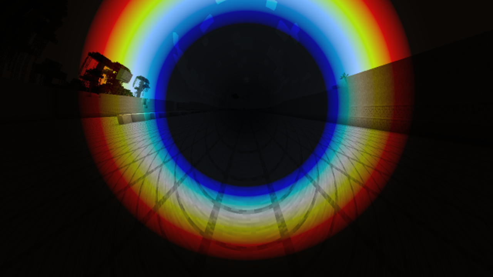
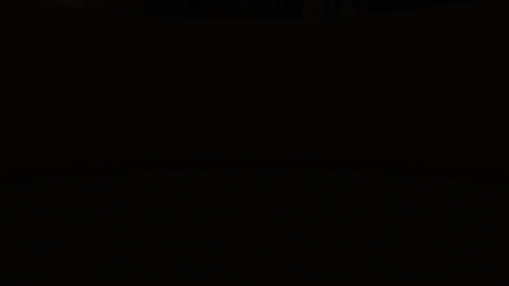

# Faint Doppler detail — 30 September 2026

> Historical implementation report or proposal. Results, defaults and pending work describe the recorded checkpoint, not necessarily the current mod. See the [current guides and status](../../README.md).

**Brightness follow-up:** the owner requested slightly more visible dark detail,
so the current floor is **6%**, raised from 4%. The captures, GPU results and timings
below describe the original 4% acceptance. The follow-up changes only the floor
constant and fixture expectations; no fresh runtime/image capture was performed.

Full shift previously assumed zero light outside 380–780 nm, producing completely
black forward and rear regions at high speed. The owner requested nearly black
detail and an assumed infrared/ultraviolet spectrum. D103 adds weak continuous
tails and a small hue-preserving exposure floor. [The feature guide](../../relativistic-sight.md)
explains the controls; [science notes](../../science.md) specify the model and its
limits. Neither the tails nor the exposure floor are measured material properties.

## Verification

- Ordinary and RTX Gradle builds pass 117 tests, zero failures/errors/skips.
  The ordinary jar has no optional RTX, Vulkan or shaderc entries.
- OpenGL programs and Vulkan shaders compile and run. The existing GPU fixture
  passes 50 ray comparisons against an independent double-precision photon boost
  (maximum direction/relative-frequency error 1.637e-6), plus 54 colour contracts.
  Contracts cover zero speed, effects disabled, exact black preservation, bounded
  output, the exposure floor, and the assumed tails' colour ordering. They verify
  implementation behavior, not the physical accuracy of an invented spectrum.
- Drank the potion and walked to the logged 0.99c cap, then froze the scene with F9.
  Inspected forward and rear views: faint ground detail remains in both. Full shift
  retains the existing bright coloured annulus; this change removes the hard
  cutoff, rather than changing the angular Doppler pattern.
- Matched GL/RTX images have MAE **0.000383/255 forward** and **0.0000224/255 rear**.
  Neither pair contains a pixel whose maximum channel difference exceeds 16/255.

1280×720 output, 640×360 optical image, 4x AA; aberration, Full colour and brightness
enabled. Frozen scene contains 4,710,346 terrain triangles. Camera is
(0.5, 67.62, -16.297), pitch 8°, with yaw 0° then 180°. Each timing set has 16 samples:

| View | OpenGL median wall ms | RTX median wall ms | Vulkan GPU median ms |
|---|---:|---:|---:|
| Forward | 23.856 | 0.675 | 0.178 |
| Rear | 12.202 | 0.672 | 0.200 |

These synchronized renderer timings include the comparison's draw/resolve work;
they are not total gameplay frame times or a before/after measurement of this
change's cost. There are no additional rays, geometry, textures or rendering
passes. [Raw samples and checks](measurements.json) are retained. The first launch
after editing shared shader includes spent roughly six minutes compiling the GL
program bank; this is shader compilation, separate from world preparation and
steady-frame work. The copied world then prepared in 23.19 seconds.

## Saved-world handling

Restored only the requested pair in **Interstellar Final QA**, using the first
layout in the owner's play-session log:

- A: (41, 88.00432496543833, 0.6045897075471959)
- B: (161, 88.2551570825417, 0.5)

Preserved mouth order, dimension and all other uncompressed save bytes; incremented
the revision to 14. The moved-pair backup, saved owner log, and exact patch record
are in ignored `run/visibility-study/`. Runtime confirmed the restored layout in
**Interstellar Spectrum QA**, a new copy used for all tests. The owner world has
no other changes from this work. Client saved/closed; six owner option/config files
restored byte-for-byte. Accepted ordinary/RTX jars and build/runtime logs are also
under `run/visibility-study/`. Earlier AA work remains preserved.

## Unadjusted captures

These are the actual RTX outputs, without brightening for this document. The rear
view is intentionally almost black; visibility depends on the display and room.

