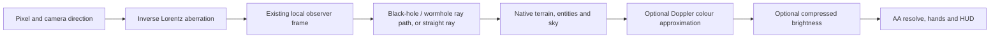

# Relativistic Sight

Drink a **Potion of Relativistic Sight**, let the world view prepare, then walk
in any direction. Your movement speed stays normal. The displayed speed is the speed of a
simulated observer used to calculate incoming light.

- Creative inventory: Food & Drinks, or search for Relativistic Sight.
- Survival brewing: Awkward Potion + Amethyst Shard.
- Operator shortcut: `/interstellar relativity potion` (also in F4 → Relativity).
- Duration: two minutes (120 seconds of game time). Milk removes it like a normal status effect.
- Default ramp: roughly 0.1c to 0.99c over 15 seconds of continuous walking.
- A bottom-left readout shows the current fraction of light speed and a charge bar.
- Stopping releases the effect within about a third of a second. A wall stops
  charging; sideways/backwards walking, sprinting and jumping continue. Flying, gliding and swimming do not charge it.

## Controls

F4 → **Relativity** contains independent controls:

| Control | What it changes |
|---|---|
| Potion visuals | Enables this potion's visual effects |
| Aberration | Changes the direction from which light appears to arrive |
| Doppler colour | Off, Gentle, or Full shift |
| Brightness / dimming | Independent directional exposure cue |
| Speed cap | 0.50c, 0.90c, or 0.99c |
| Walk ramp | 10, 15, or 25 seconds |

F10 remains the master switch for all Interstellar world visuals. The Graphics
tab controls the shared quality and OpenGL/RTX backend. Relativity settings are
saved separately in `config/interstellar-relativity.json`. Turning a single
component off leaves the other components enabled. Turning all three off stops
the simulated observer. The potion itself continues its normal duration.

The boost follows your actual horizontal travel direction, not the crosshair.
Looking sideways while moving lets you see the asymmetric view. Near 0.99c the
distortion is intentionally strong; try the 0.50c cap to learn the effect first.

## How the picture is calculated

The GPU traces backwards: given a direction in the boosted observer's view, it
finds the direction in the baseline camera frame. An independent CPU reference
boosts a photon four-vector to check the shader's direction and frequency ratio.
At zero speed this transform returns the original ray. The added observer speed
is defined relative to the existing local optical camera frame, before that frame
is mapped into the black-hole or wormhole coordinates. It does not change their
mass/radius settings. Mixed mass-and-wormhole geometry retains its documented
approximate spatial metric.

Forward scenery concentrates into a smaller angular region. Light ahead shifts
toward higher frequencies; light behind shifts lower. Aberration can be switched
off while retaining the frequency effects: that educational combination uses the
unshifted baseline direction to calculate the Doppler factor.

### What the colour controls mean

Minecraft stores RGB, not a physical spectrum. Colour therefore uses an explicit
approximation: a piecewise linear spectrum through blue (450 nm), green (550 nm)
and red (650 nm), with weak ultraviolet and infrared tails. The transformed
spectrum is sampled back into RGB. These tails are **invented material properties**,
derived from texture brightness and colour; they do not recover a real spectrum
or simulate temperature. They allow otherwise invisible light to enter the visible
band as the observer moves, without the old hard cutoff to black.

**Full shift** uses the actual frequency multiplier. At 0.99c directly ahead,
light is shifted about 14 times higher in frequency: infrared can become visible.
Directly behind, the inverse shift can bring ultraviolet into view. Both extreme
views remain deliberately very dark with our weak tails.
**Gentle** compresses the logarithmic shift to 6% for a readable default.
Brightness is a separate compressed, bounded cue inspired by bolometric Doppler
beaming, with a highlight shoulder. It is not calibrated radiometry. Both switches
off preserve the original material colour; aberration can still be shown alone.

With Doppler colour enabled, an additional exposure floor preserves the shifted
hue and keeps the brightest output channel at least 4% of the original pixel's
brightest display-RGB channel. This is **a visibility aid**, not a claim about real
emission or human vision. Dark textures stay proportionally darker; a black input,
including a black-hole silhouette, stays black. Behind a real fast-moving observer,
ordinary scenery might be effectively invisible: its UV spectrum, illumination,
exposure and the observer's sensitivity determine the result. Speed alone does not
imply either complete blackness or a guaranteed residual glow.

### Boundaries of this feature

- This is an instantaneous optical observer, separate from Minecraft movement.
  Server time, ageing, mob clocks and collision/reach are unchanged.
- It does not reconstruct past positions of moving objects or provide full
  retarded-time animation. Do not interpret every moving mob as a complete
  Terrell-rotation/time-delay simulation.
- The Doppler cue is for the added observer boost. Gravitational spectral transport
  and a consistent emitter/observer velocity history remain separate work.
- Hands and HUD stay readable. Foreground rain/snow keeps its existing approximate
  treatment. No distant terrain beyond the captured/loaded region is invented.
- Standing still in a pure potion view uses Minecraft's native image. The scene
  cache stays warm, but the extra ray pass and moving-entity capture are skipped.
  Moving into new chunks still has the existing bounded capture work.
- OpenGL and optional RTX use the same optical/material functions. The ordinary
  build continues to exclude Vulkan and shaderc dependencies.

## Validation

CPU tests cover boost inversion, the forward Doppler factor, aberration sign,
normalization, ramp/cap behaviour and release. Frozen F9 → Ctrl+Alt+C checks 50
actual shader rays against the independent double-precision photon reference,
including 0.99c and aberration disabled. It also exercises 54 colour contracts:
identity/disabled controls, black preservation, finite bounded output, faint detail,
and the tail model's forward-blue/rear-red ordering. These do not certify spectral
accuracy.
Runtime results, screenshots and timings are in the
[original acceptance report](profiles/2026-09-29-relativistic-sight/README.md).
[Walking and live-edit follow-up](profiles/2026-09-29-live-edits-and-walking/README.md)
records the updated controls, duration and runtime checks.
[Spectral-tail acceptance](profiles/2026-09-30-spectral-visibility/README.md) records
the faint-detail checks, current shader fixture, paired images and timings.

Primary background: [Kraus: high-speed flight](https://www.spacetimetravel.org/aur),
[Kraus and Zahn: spectral requirements for relativistic visualization](https://www.spacetimetravel.org/ejpvis/ejpvis.pdf),
[Einstein Online: Doppler](https://www.einstein-online.info/en/spotlight/doppler/),
and [MIT OpenRelativity](https://github.com/MITGameLab/OpenRelativity). No code from
those implementations is copied into this feature.
