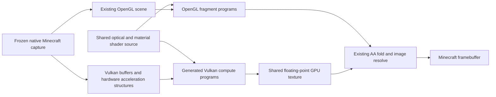
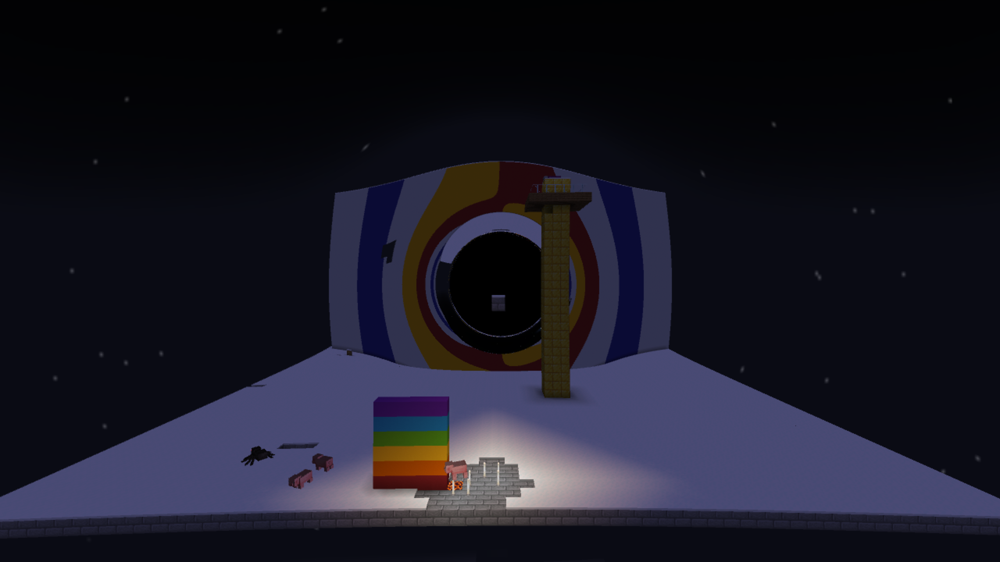

# RTX full-image experiment — 28 September 2026

> Historical implementation report or proposal. Results, defaults and pending work describe the recorded checkpoint, not necessarily the current mod. See the [current guides and status](README.md).

**The complete frozen optical renderer benefits substantially on this GPU.** At
2560×1440 output, the heavy down-looking view takes **22.132 → 3.543 ms** and the wall
view **9.826 → 3.417 ms**, including completion on both APIs. These are **6.25× and
2.88×** improvements in frozen optical-frame cost, not live Minecraft FPS.

Images agree closely: only **4 and 8 output pixels**, respectively, have a maximum
channel difference above 16/255. Small differences remain; this is not pixel-exact
or comprehensive feature validation. The ordinary OpenGL renderer remains available.
The opt-in experiment does not replace F10.

## What changed

The solver still follows curved light paths as short straight chords. Hardware ray
queries search for geometry along those chords. The shared production shader supplies
orbit integration, material acceptance, lighting, fog, sky, compositing and AA samples.



Unlike the earlier recorded-query replay, this computes every pixel's complete path
and colour. Turning the camera produces a fresh Vulkan image. Implementation:

- `FrozenWorldBackend` has no Vulkan types. `FrozenBackendCapture` exports geometry
  and snapshots five native appearance textures once; later frames pass uniforms.
- `FullImageShader` generates compute programs from `terrain_shared.glsl`, replacing
  traversal and the entry point. Checked source markers reject incompatible edits;
  there is no hand-copied orbit solver to drift from the OpenGL implementation.
- A top-level structure references terrain, actor and cloud structures. Shader
  alpha/material tests accept candidates; hardware barycentrics feed native shading.
- Two AA samples occupy one side-by-side RGBA32F image. Initial rays run first, then
  a masked material dispatch. Existing GL fold/resolve code consumes the result.
- Win32 external memory and two GPU semaphores synchronize texture ownership.
  **There is no CPU image copy per rendered frame.** Screenshot readback is outside
  timing. Glowing-outline rendering remains a common GL pass where applicable.
- The software empty-space bounds cache is absent: hardware traversal does not expose
  the rejected bounds needed to reproduce it. Each chord issues a hardware query.
- One frame is allowed in flight; uniform writes/command reuse are fenced. Live
  updates and a less serialized production pipeline remain separate work.

No optical equation or production quality default changed. Different traversal and
floating-point execution still require empirical comparison.

## Measurements

RTX 5070 Ti, driver 616.92; Ryzen 7 5800X3D. Frozen N65 source, radius 3.5182282;
eye `(16.5, 303.6199998855591, -45.5)`, yaw 0.281°. Down pitch 35.91°, wall ~0.91°.
Geometry: 6,261,506 terrain + 6,256 actors/block entities + 2,688 clouds = **6,270,450
triangles**; 44 entities and 5 block entities. Actor state differs from earlier
sessions, so these are paired comparisons, not historical performance claims.

Both paths use scale 0.5, sharp two-sample AA and default adaptive/selective settings.
1440p output therefore uses a 1280×720 logical image, with two samples per pixel.

| Output / view | OpenGL wall ms | RTX wall ms | Speedup | Vulkan GPU ms |
|---|---:|---:|---:|---:|
| 2560×1440, down |22.132|3.543|6.25×|3.025|
| 2560×1440, wall |9.826|3.417|2.88×|2.914|
| 1280×720, down |10.141|1.808|5.61×|1.016|
| 1280×720, wall |4.167|1.413|2.95×|0.922|

Each median uses four paired warm-ups then 16 paired rounds with alternating order.
Wall time includes CPU submission, optics, handoff, fold/resolve and explicit
completion. Vulkan timestamps cover its dispatches/ownership barriers, excluding
later GL resolve. A fallback during comparison aborts it instead of reporting false
RTX success.

Initial checks found that **GL timestamps sometimes omit external Vulkan work**.
Final measurements explicitly finish both APIs and read Vulkan's own clock. Raw GL
timeline numbers are retained, but not treated as complete RTX GPU duration. The
Vulkan query read is inside the conservative RTX wall measurement.

This is a short, warm, sequential frozen-render test. Live scene capture/updates,
normal game rendering and gameplay CPU work are absent. It is not a sustained FPS
or frame-pacing measurement, but does justify progressing to the live-update trial.

## Image checks

Final RGB8 frames are read before the HUD. Errors below use colour levels 0–255.

| Output / view | Changed pixels | Pixels with max error >16 | RGB mean absolute error | RGB RMS error |
|---|---:|---:|---:|---:|
| 1440p down |1,311|4|0.000264|0.038729|
| 1440p wall |747|8|0.000198|0.046339|
| 720p down |474|3|0.000459|0.047198|
| 720p wall |245|8|0.000575|0.092447|

At 1440p the largest difference is 36/255, confined to tiny platform patches. Most
other differences are one colour level. The cause of the few larger differences
has **not** been isolated; do not call them proven rounding-only errors. Matched
crops and amplified difference images are retained. Final RGB8 agreement does not
prove every intermediate sample, near-horizon path or special material correct.

The complete wall image, differing crops and earlier down image were inspected.
No broad terrain/sky/FOV discrepancy was visible. View rotation, GL/RTX toggling and
resize/reinitialization passed. Automated movement/flicker testing remains deferred.



## Setup and memory

Existing terrain capture took **29.91 seconds**. After that, experimental export,
CPU preparation, upload and pipelines took roughly **3–4 seconds** by the log;
this is not a precise CPU-stage profile. The 1440p setup recorded:

- Expanded vertices: 902,944,800 bytes; hardware structures: 387,805,696 bytes.
- Bounded upload staging: 18,874,368 bytes; geometry copy 2.107 ms GPU.
- Bottom-level build 14.124 ms GPU; top-level build 0.033 ms.

Whole-board memory was about 2,510 MiB before RTX, at most 3,973 MiB in one-second
setup samples, and 3,955 MiB in a later reading: **roughly 1.4 GiB additional while
both representations exist**. These are not process allocations, a guaranteed peak
or a minimum VRAM requirement; brief peaks can be missed. Closing on resize reduced
the reading to 2,356 MiB before reinitialization.

This prototype reuses expanded replay geometry and a software CPU ordering step.
Production should keep compact geometry, release temporary storage and update only
changes. It should not export a gigabyte to disk when entering gameplay.

## Compatibility and reproduction

`-PinterstellarRtxImage` adds experimental sources and Vulkan/shaderc bindings.
Without it, those classes/dependencies are absent. The API boundary permits a
combined installation with fallback or a separate OpenGL-only distribution;
production packaging is not finalized. This uses Vulkan alongside Minecraft's GL
renderer, **without depending on VulkanMod**. It currently requires compatible
Windows sharing/ray-query support. Other platforms, vendors and shader mods are untested.

```powershell
./gradlew.bat runClient -PinterstellarRtxImage
```

Record owner state first. Use a frozen ordinary exterior BH source in F9. Shift+M
selects native streamed capture and initially disables lensing; Space restores it.
Wait for `Streaming terrain ready:` and retain default quality/material settings.

- **Ctrl+Alt+V:** initialize, then toggle RTX/OpenGL.
- **Arrows / L:** change direction using the same scene.
- **Ctrl+Alt+P:** paired screenshots and synchronized timings under `run/rtx-image`.
- Resize or changed settings close the backend; Ctrl+Alt+V initializes it again.
- Use paired timing: B's GL-only benchmark is unavailable while RTX is active.

F10, extended-body and horizon/interior rendering remain OpenGL. Setup/render errors
request fallback; device loss, memory-pressure recovery and long-play lifecycle are
untested. Final small control guards and constructor-failure cleanup were compiled
and fixture-checked after image capture; the measured shaders were unchanged.

Diagnostic build and clean normal build pass; **79 tests** pass. The existing analytic
material fixture passes 736 paired queries and 256 sampled CPU checks after the shared
probe refactor. The normal jar excludes the experimental classes and Vulkan bindings.
Full optical fixtures were not rerun because no optical equations changed.

Evidence: [profiles/2026-09-28-rtx-image](profiles/2026-09-28-rtx-image). Regenerate with
`py -3 tools/analyze-full-image.py docs/profiles/2026-09-28-rtx-image`.
Large geometry dumps stay ignored; a SHA-256 manifest identifies the measured input.
The earlier exploratory 720p run predates the explicit Vulkan clock and is excluded.

Restore ordinary development with `./gradlew.bat clean build` and
`./gradlew.bat runClient`, without the property.

## Next bounded milestone

Keep static terrain resident and update/refit actors plus relevant textures. Measure
complete live-frame cost, update spikes, memory and moving-material correctness with
fallback retained. Then address chunk replacement, other optical variants, production
lifecycle and distribution. The frozen result supports continuing; it does not yet
establish production parity or a final FPS promise.
