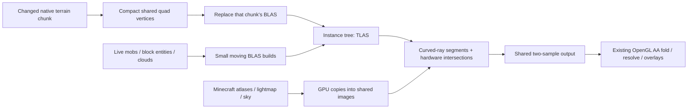

# Live RTX world integration — 28 September 2026

> Historical implementation report or proposal. Results, defaults and pending work describe the recorded checkpoint, not necessarily the current mod. See the [current guides and status](README.md).

The optional RTX backend now renders the live F10 exterior black-hole view. Mobs,
clouds, native appearance and edited/streamed terrain update while playing. The
OpenGL renderer remains available, and ordinary builds have no Vulkan dependency.

## Measured result

RTX 5070 Ti, NVIDIA 616.92, Ryzen 5800X3D; 2560×1440 output, 1280×720 optical
resolution, existing sharp 2× AA. Same legacy world and two fixed viewpoints.
Simulation was running for these tests. Each cell is the median of three runs;
each run has 120 warmup frames and 300 samples.

| View | OpenGL frame interval | RTX frame interval | Approximate FPS, GL → RTX | Frame p95, GL → RTX |
|---|---:|---:|---:|---:|
| Down toward distant terrain | 23.981 ms | 8.361 ms | **42 → 120** | 26.129 → 9.331 ms |
| Toward wall/black hole | 11.640 ms | 8.352 ms | **86 → 120** | 13.180 → 9.360 ms |

The existing 120 FPS cap and VSync setting were retained. RTX reaches that cap;
these figures do not establish its uncapped maximum. Vulkan GPU time, including
moving-geometry structure builds and optical rendering, was 3.327/3.263 ms in the
two views. That clock excludes GL texture copies and the final GL resolve. Frame
intervals include the complete running client and are the appropriate FPS evidence.
The standalone paired optical-frame timings are archived separately; they omit
the outer live capture and normal Minecraft frame work.

Runs were grouped by renderer, with an additional return to the heavy RTX view
(8.345 ms median). Entities and lighting evolved between groups. This is evidence
for these views on this machine, not a universal FPS guarantee. An initial set
with the wrong camera pose was discarded; the summary script checks pitch.

### OpenGL-only regression check

The before build is `2f4bd2d`. The after build excludes the optional source set and
Vulkan/shaderc dependencies. Identical source, camera, resolution, quality and
settings; simulation frozen during each measurement; three runs per view.

| View | GPU p50 before → after | Change | Frame p50 before → after |
|---|---:|---:|---:|
| Down | 24.437 → 23.762 ms | −2.76% | 25.050 → 24.404 ms |
| Wall | 11.073 → 10.821 ms | −2.27% | 11.576 → 11.385 ms |

**No regression was observed.** Do not attribute the small improvement to the new
backend: the OpenGL optical shaders are unchanged, hardware state varies, and one
entity differed after restarting (8,944 → 8,908 moving triangles). Static terrain
remained 6,261,506 triangles. The new common-path work is a revision increment on
chunk publication and a disabled backend branch; no Vulkan synchronization,
geometry readback or image copies run in an ordinary build.

## What updates each frame



A **BLAS** is an acceleration structure over one geometry group. Each retained
terrain chunk has its own BLAS. The **TLAS** is the small tree of instances that
lets a ray search those chunks and the moving groups together.

- Terrain keeps the production four-vertex quad layout. A reusable index buffer
  supplies its two triangles. Hardware primitive IDs and instance offsets map
  hits back to the same positions, UVs, light coordinates and vertex colours.
- Each chunk has a revision. New/replaced chunks alone are read from the GL arena,
  copied to Vulkan and rebuilt. Removed chunks release their structures. Static
  terrain has no per-frame readback or disk export.
- Actors and clouds use separate small BLAS with visibility masks. Their bounded
  buffers and acceleration allocations are reused. Geometry is rebuilt each
  updated frame; topology can change, so this first implementation does not refit
  an assumed stable mesh. The instance tree is then rebuilt.
- Native block/entity/cloud atlases, lightmap and sky are copied GPU-to-GPU into
  shared images. The first version copies all five each frame; there is no CPU
  image readback. Revision-aware texture copies are a later optimization.
- Vulkan compute programs are generated from the production optical/material
  GLSL. The orbit integration, material acceptance, lighting, transparency and
  cloud composition remain shared. Hardware queries replace intersection search.
- Win32 external memory, device UUID matching, ownership barriers and two GPU
  semaphores connect Vulkan to Minecraft's OpenGL renderer. Exported handles are
  closed after import. One frame is in flight; CPU geometry mutation waits for
  prior Vulkan work to finish.

The existing native terrain preparation still dominates startup (about 30 seconds
in these runs). Initial Vulkan chunk construction took roughly 1–2 seconds in
coarse logs, followed by shader/interop setup. A test glass-block edit rebuilt
one chunk. This does not establish a worst-case edit or streaming latency.

Whole-board memory snapshots were 4,142 MiB with live RTX and 2,565 MiB in the
normal client afterward. Approximately 1.54 GiB extra was observed while retaining
both renderers. These include the desktop and are neither isolated allocations
nor peak measurements. The 715 MB Vulkan terrain arena and chunk acceleration
structures are the main additional storage.

## Image and lifecycle checks

Pairs render the same captured live frame through both backends. RGB errors use
8-bit channel values. The threshold counts pixels whose largest channel error is
greater than 16; it is a diagnostic, not a scientific acceptance criterion.

| Case | Resolution | Mean absolute channel error /255 | Pixels over 16 |
|---|---|---:|---:|
| Wall, frozen simulation | 1280×720 | 0.000572 | 8 |
| Wall, frozen simulation | 2560×1440 | 0.000201 | 8 |
| Down, running world | 2560×1440 | 0.000642 | 12 |
| Added transparent block | 2560×1440 | 0.000272 | 0 |
| Different chunk window | 2560×1440 | 0.000420 | 8 |
| Return from inside horizon | 2560×1440 | 0.000314 | 8 |

The last pair was captured while 72 native chunks were still queued; both paths
used the same currently published terrain. The dedicated chunk-window pair had
no queued chunks. Very small differences remain, as in the frozen prototype.
No claim of pixel identity or new scientific validation is made.

Runtime checks covered live entity updates, transparent block add/removal,
chunk replacement/removal, resize/reinitialization, manual GL/RTX switching and
automatic horizon fallback/resumption. Setup failures during development retained
OpenGL. Ordinary native preparation, optics and gameplay tests pass (79 tests).
The analytic material fixture also passes 736 paired queries and 256 CPU checks.
Final initialization guards were compiled after the image runs. Device-loss,
other vendors/OSes and a long-duration movement suite remain untested; the owner
has explicitly deferred automated movement/flicker testing.

### A useful failure caught by the checks

The initial live image had correct sky but missing terrain. An independent ray
through a known captured triangle proved that vertex upload was correct while
the acceleration structure was empty. LWJGL's `pGeometries` setter does not fill
`geometryCount`; setting the latter explicitly fixed it. The initialization ray
remains as a bounded check that fails back to GL if captured terrain cannot be
intersected. The shared probe TLAS helper also sets the count explicitly now.
No timings from the broken image were accepted.

## Use and supported configurations

```powershell
.\gradlew.bat runClient -PinterstellarRtx
```

F10 uses RTX automatically for a ready **ordinary exterior black-hole** scene with
the default selective-material/quad renderer. Alt+F12 switches between RTX and
OpenGL; F12 measures the active path. Ctrl+Alt+F12 saves matched images and
synchronized optical-frame timings under `run/rtx-image`.

Extended mass objects, near/inside-horizon views and unsupported diagnostic
settings use OpenGL automatically. Returning to the supported view resumes RTX.
Errors retain OpenGL and log the reason; Alt+F12 permits an explicit retry.
F9's earlier frozen experiment remains available with `-PinterstellarRtxImage`.

This is a Windows development configuration using the graphics driver's Vulkan
support beside Minecraft's existing OpenGL context. It does not use VulkanMod.
The backend API contains no Vulkan types; reflection only loads the optional
implementation when requested. Both the ordinary jar and dependency graph were
checked to exclude optional classes and Vulkan/shaderc. This preserves the option
of a future Vulkan-free distribution. No new distribution flavour or installer
has been packaged.

Next useful work: extend hardware support to the remaining optical variants,
measure worst-case update spikes, reduce unnecessary copies/rebuilds, and harden
cross-device lifecycle before production packaging. Preserve GL throughout.

## Evidence

Raw logs, six image comparisons, a representative image pair and fixture results:
[profiles/2026-09-28-rtx-live](profiles/2026-09-28-rtx-live).
Full-resolution local images remain under `run/rtx-image`.

```powershell
py -3 tools/analyze-live-rtx.py docs/profiles/2026-09-28-rtx-live/live-timings.txt docs/profiles/2026-09-28-rtx-live/gl-regression.txt
```

Earlier [frozen full-image report](rtx-full-image-2026-09-28.md) explains the
shared optical shader and interop baseline. Official API references:
[Vulkan structure builds](https://docs.vulkan.org/refpages/latest/refpages/source/VkAccelerationStructureBuildGeometryInfoKHR.html),
[OpenGL external objects](https://registry.khronos.org/OpenGL/extensions/EXT/EXT_external_objects.txt),
[OpenGL image copies](https://registry.khronos.org/OpenGL/extensions/ARB/ARB_copy_image.txt).
