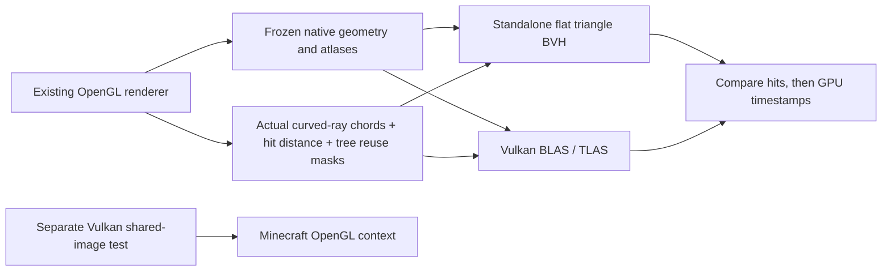

# RTX with real Minecraft geometry: feasibility checkpoint

> Historical implementation report or proposal. Results, defaults and pending work describe the recorded checkpoint, not necessarily the current mod. See the [current guides and status](README.md).

**Decision: proceed to a bounded full-image prototype; do not adopt a production backend yet.**

RTX queries work on our actual captured geometry and ray segments, including tested
material rejection rules. Vulkan can also hand an image to Minecraft's OpenGL context
without a CPU pixel copy. Those were two substantial uncertainties. Both now have
working implementations and measured evidence.

The next uncertainty is the complete renderer: integrating curved rays, resolving
materials and AA, sharing the output, and updating moving geometry within one frame.
**This experiment does not measure Minecraft FPS with RTX.** The production renderer,
its optical model and its quality defaults remain unchanged.

## Results worth keeping

RTX 5070 Ti, driver 616.92, Ryzen 5800X3D, Windows, Java 21 / LWJGL 3.3.3.
The isolated replay ran with Minecraft closed normally. A separate sharing test ran
inside Minecraft's real OpenGL context on the same GPU, matched by device UUID.

### Actual captured queries

Two views of the same frozen scene: looking down at distant terrain and facing the
calibration wall. Scene: **6,273,150 triangles**, including 6,261,506 terrain triangles,
8,956 actor/block-entity triangles and 2,688 cloud triangles. Source N65,
r_s=3.5182282; eye (16.5,303.6199999,-45.5), yaw 0.281°, pitch 35.91° /0.91°.
Output 2560×1440, logical 1280×720, sharp 2x AA, render distance 12.

| Query workload | Recorded queries | Software P50 | RTX P50 | Ratio |
|---|---:|---:|---:|---:|
| Down: initial rays, alpha-aware |286,235|0.121896ms|0.015916ms|**7.66×**|
| Wall: initial rays, alpha-aware |336,218|0.071216ms|0.012576ms|**5.66×**|
| Down: material-pass rays, alpha-aware |231|0.027388ms|0.004124ms|6.64×|

The wall's sparse sample contained **zero material-pass queries**; there is no timing
for that case. The 231-query material test is too small to generalize. Disabling
alpha rejection gives 7.89× down and 5.86× wall; the down material sample gives 7.01×.
An earlier down capture, with slightly different actor positions, gives 7.48× for
alpha-aware initial queries. It is a consistency observation, not an identical repeat.

**The software column is a new standalone triangle BVH, not today's OpenGL renderer.**
Both columns replay the same compact query array and material rules. They do not
include integration, full shading, cache construction, uploads or frame scheduling.
These small batch times cannot be scaled directly to the previous 22.52ms optical frame.

### Vulkan → OpenGL image sharing

| Shared RGBA8 image | Median wall time per cycle | Five-batch wall range | Median GL timeline |
|---|---:|---:|---:|
|854×480|0.1691ms|0.1669–0.2195ms|0.1489ms|
|2560×1440|0.1784ms|0.1732–0.1832ms|0.1584ms|

Each cycle clears the image in Vulkan, transfers ownership to GL, blits it into a
private GL texture, and returns ownership to Vulkan. Two external binary semaphores
synchronize the APIs. The image allocation is shared; **no CPU pixel transfer occurs
inside the timed batches**. An explicit GPU blit still occurs and is included.

Both sizes pass 65 sampled pixel checks, across eight warmups and five 31-cycle batches
(163 cycles per size). CPU readback is outside the timed batches. GL finishes only
at batch boundaries during timing. The GL timeline includes waits between APIs; it
is not a timestamp of Vulkan shading alone.

This is a small clear/blit test, with easily compressible solid colours, one image
format and no simultaneous game rendering. It establishes workable sharing, not
the final backend's overhead or a guarantee against driver issues during long play.
Reverse ownership synchronization is exercised; GL-written content read by Vulkan is
not tested. No Vulkan validation layer was installed.

## What changed



**Capture.** Two opt-in GLSL programs log the real `meshSegment` inputs into a shader
storage buffer at every 16th pixel in X and Y, for both AA samples. They record the
start, displacement, expected nearest-hit parameter, pixel/sample/pass/sequence and
which trees survived the production empty-region cache. This is actual rendering
work, not rays invented to resemble the scene. Buffer overflow, invalid chords or
unfinished traversal abort the export.

Every capture compares all float RGBA components of each diagnostic pass against
its ordinary shader. Both passes in both views have **zero differing components**.
The macro compiles away in normal programs. Shader logging is not included in any
performance claim; blocking readback and file export are diagnostic-only.

**Geometry.** Occupied streamed quad rows are read from the existing GPU textures.
Each quad becomes its original two triangles; moving geometry comes from its existing
CPU capture. Position, tag, UV/light and colour attributes are preserved. Terrain,
actors and clouds become three separate ray-tracing acceleration structures (BLAS),
referenced by a tiny top-level instance structure (TLAS). Instance masks retain the
recorded tree skips. No saved-world files are parsed or edited by the replay tool.

**Comparison.** Software uses a midpoint-split BVH with eight-triangle leaves and
escape links. Hardware uses Vulkan ray queries. Both apply the same candidate
acceptance function and return nearest accepted distance, primitive ID and barycentrics.
The hardware traversal accelerates straight chords; the black-hole integration is
still ordinary shader work and is outside this test.

**Materials.** Acceptance handles sidedness, atlas alpha, emissive thresholds,
translucent surface acceptance, glint/shadow UV wrapping, text red-channel coverage,
cloud opacity and mass tags. Transparent continuation is represented by subsequent
recorded queries. This does **not** validate full colour compositing, lighting, glint
animation or transparency ordering. Returning-body tags are explicitly excluded.

An independent small analytic fixture supplies 184 triangles and 368 rays with known
plane-hit distances. It exercises holes, 5% alpha versus ordinary 10% cutoff, the
emissive 0.1% cutoff, front/back faces and the special tags. Fixture timings are not
performance evidence; all four pass/acceptance combinations pass.

## Correctness evidence and its boundaries

- **1,245,368 paired hardware/software query comparisons** over the two views and
  two acceptance modes; zero unexplained differences and zero classified boundary
  differences. Every alpha-aware recorded nearest-hit answer matches the production
  capture. Maximum paired hit-parameter difference is 1.78814e−7.
- 384 sampled double-precision CPU checks over those six cases also pass. They use
  independent double triangle/material calculations, but the **same BVH bounds and
  topology** as the software GPU. They are not independent brute-force traversal.
- The analytic fixture adds 736 paired comparisons, known expected distances in the
  alpha-aware cases, and 256 sampled CPU checks. No differences.
- Distance tolerance is `1e-4 + 2e-5*abs(t)`, with `t` ranging 0–1 along each chord.
  It is not a fixed world-space distance. Nonfinite outputs abort. Unexpected mismatch
  suppresses that case's timing; numerical boundary disagreements require agreement
  with the double reference and are logged separately, never silently dropped.
- Coplanar primitive-ID ties are counted separately from distance agreement; none
  occurred here. General equal-depth material ordering is not established.
- Atlas replay currently uses nearest/clamped sampling plus explicit UV wrapping
  for the relevant special tags. Sampler/mipmap state is not exported. The sampled
  production hit agreement does not establish parity for every texture configuration.
- Both views are exterior, frozen and use the ordinary BH program. Interior,
  extended-source, returning-body, animated texture and general live-world coverage
  remain untested for an RTX backend.

Raw logs retain counts, masks and errors. The initial pass is mostly opaque; the
analytic fixture supplies coverage that this particular camera does not provide.

## Why the ratio is encouraging, but not an FPS estimate

About 75% of down-view records and 85% of wall-view records skip all trees because
the existing renderer already proved that region empty. Those records remain in
both dispatches and exit early. The ray sequence itself was recorded after actual
production hit/continuation decisions, including termination after hits.

However, replay flattens the records into a new compute dispatch. It removes the
integration registers, inactive lanes, surrounding material work and original
pixel-to-chord execution pattern. It consumes precomputed skip masks without paying
to establish or maintain them. Warm data is deliberately reused. Hardware and
software share these advantages, but the existing renderer does not run this workload
in isolation. The speedup justifies the next experiment; it does not finish it.

Measurement: eight warmup pairs of four dispatches, then 24 measured pairs of eight
dispatches, alternating execution order. Write barriers serialize result-buffer reuse.
GPU timestamps include dispatch/barrier costs and are divided by eight. P50 uses the
nearest-rank convention, matching the original probe. Raw sample arrays are retained.

## Setup cost and an instructive allocation failure

| Setup operation, second scene | Observed cost / size |
|---|---:|
|CPU construction of comparison BVHs|1,409.8ms|
|GPU copy commands for expanded geometry|2.058ms|
|Build three hardware BLAS|15.251ms GPU|
|Build TLAS|0.0327ms GPU|
|Hardware acceleration-structure storage|388.0MB|
|Expanded native geometry buffer|903.3MB|
|Reusable upload staging buffer|18.9 MB|

These are one-time observations, not distributions or end-to-end preparation time.
The copy time excludes CPU packing, API submission/waits, disk I/O and shader setup.
Software BVH construction is a comparison cost, not inherently required by an RTX backend.

The first large upload failed when it requested one 900MB allocation in host-visible,
device-local memory. The GPU-local allocation succeeded when fed through a bounded
18.9 MB staging buffer. The lesson is specific: a small successful microbenchmark does
not establish that its allocation strategy scales to captured Minecraft scenes.

The expanded triangle export also discards the current renderer's shared quad-vertex
savings. It is a convenient interchange format, not a proposed production layout.
An implementation should evaluate indexed geometry/separate attributes and chunk
structures, avoid retaining unnecessary duplicate representations, and measure peak
VRAM while OpenGL and Vulkan coexist. **Live rebuild/refit costs are not measured.**

Two smaller integration issues were fixed during runtime verification: the diagnostic
Vulkan initialization needed a larger LWJGL stack, and the semaphore binding required
an empty Java buffer rather than null for zero buffer barriers. The final replay
shortcut is Ctrl+Alt+R because Minecraft also handles Ctrl+B as its narrator shortcut.
Narrator was returned to disabled.

## Next milestone and stopping rule

Implement one opt-in **frozen full-image path** that keeps the current optical
integration and material rules, replaces geometry search with Vulkan ray queries,
and presents the result through shared GPU memory. Keep the current OpenGL path
available for matched image and timing comparisons.

Success means comparable fixed-pose images, no unexplained missing surfaces, and a
useful **whole optical-frame** reduction on both views with every pass and handoff
included. Measure steady state, initialization time and peak VRAM separately. If the
gain largely disappears, investigate before expanding the backend. No particular FPS
gain is promised by this checkpoint.

Only after that should we add live actor updates and chunk edits, testing BLAS
rebuild/refit tradeoffs and avoiding full-terrain rebuilds per frame. Device-loss,
resize/resource lifecycle, feature parity and supported-driver fallback remain
production work. CPU moving-tree reuse and sparse material scheduling remain useful
alternatives if the hardware route proves too expensive to maintain.

## Reproduction, artifacts and checks

See [tool instructions](../tools/rtx-probe/README.md#native-capture-and-interop-milestone).
Raw small evidence is in [profiles/2026-09-28-rtx-native](profiles/2026-09-28-rtx-native).
`capture-manifest.json` records SHA-256/size for the second capture's binary inputs;
the large world/texture dump remains in ignored `run/rtx-native/capture-1790563283292`.
Archived results can be reanalyzed without that dump:

```powershell
py -3 tools/analyze-native-replay.py
```

The tool writes `summary.json`. Earlier single-view and analytic-fixture results are
retained separately; neither is silently pooled with the main two-view run.

Diagnostic build and clean normal build pass; all 79 existing tests pass. Two capture
shaders compiled in game. Pixel equivalence, ray correctness and real-context sharing
checks passed; a representative wall screenshot was inspected after sharing/export.
Normal F10 subsequently reached ready on the owner's unchanged N8 source. Normal jar
inspection finds no experimental interop class or Vulkan bindings. Final control/
metadata-only edits were compiled; recordings used the earlier Ctrl+Alt+B shortcut.
No optical equations changed; full optical fixtures and automated movement/flicker
tests were not rerun. No new normal-path FPS improvement is claimed.

Primary API sources: [Vulkan ray queries](https://docs.vulkan.org/guide/latest/extensions/ray_tracing.html),
[external GL memory and semaphores](https://registry.khronos.org/OpenGL/extensions/EXT/EXT_external_objects.txt),
[acceleration-structure build/update rules](https://docs.vulkan.org/refpages/latest/refpages/source/VkAccelerationStructureBuildGeometryInfoKHR.html).
