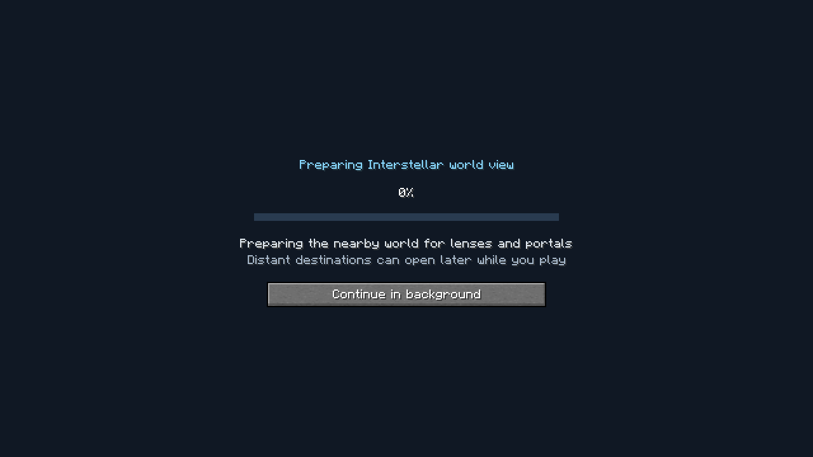
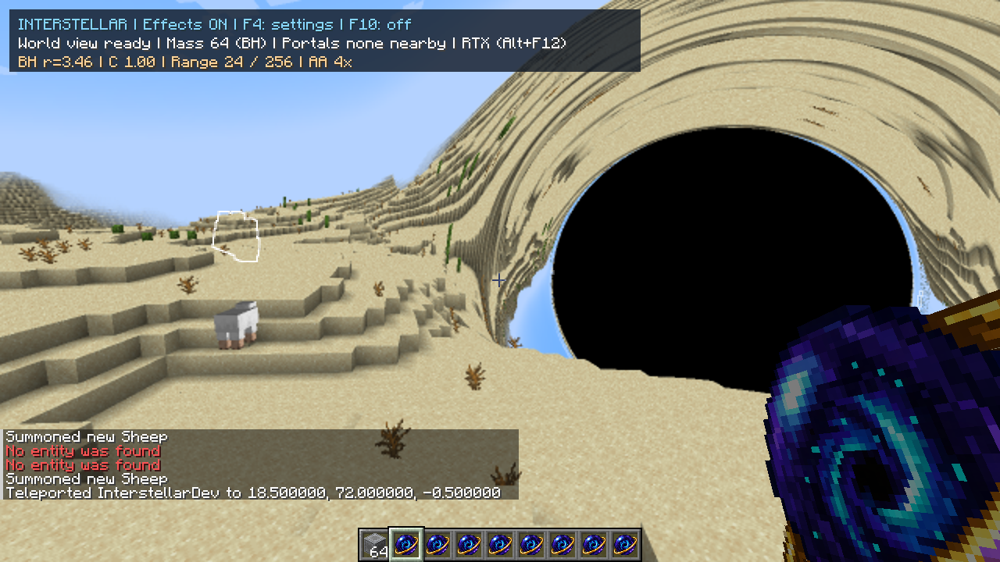
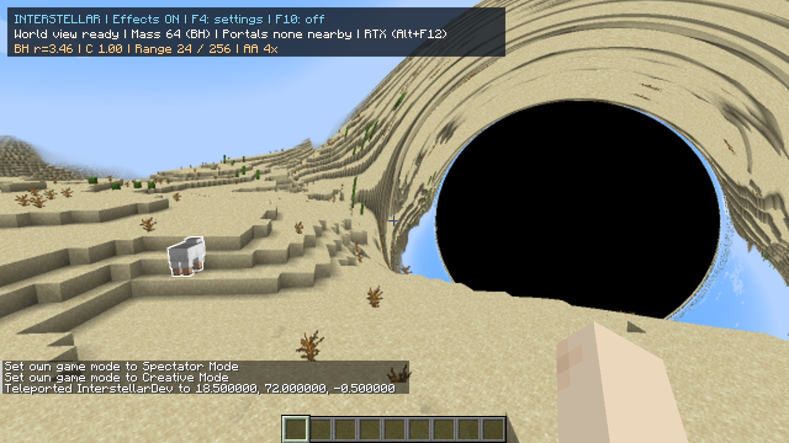
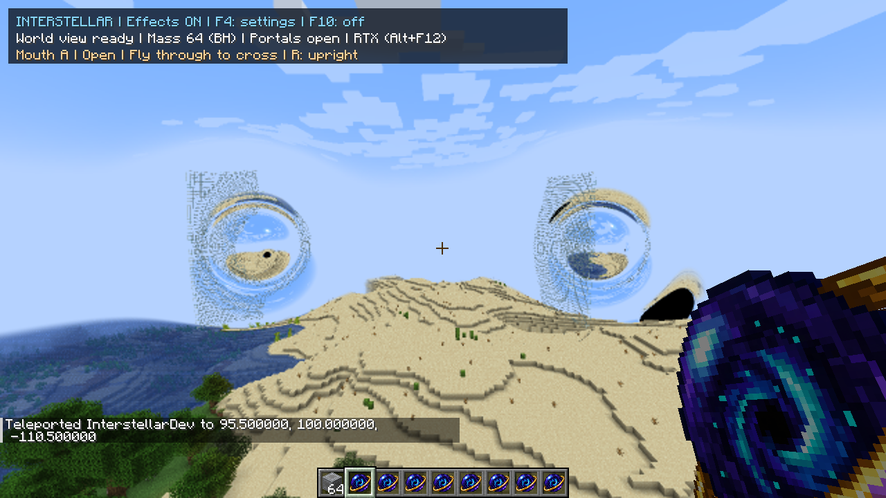
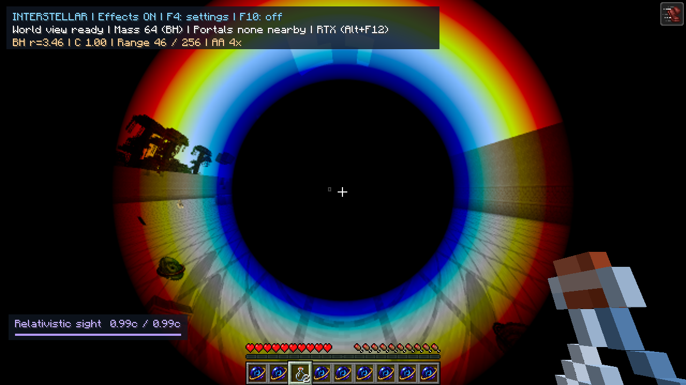

# World-entry preparation and gameplay bug bash — 30 September 2026

## What changes for players

When **World effects** is enabled (F4 / F10), every world now finishes with a
**Preparing Interstellar world view** screen. No mass block, Rift Pearl or potion
is required. It captures the nearby loaded world and initializes the selected
renderer before handing over control. **Continue in background**, or Escape,
lets you enter early. Effects disabled means no extra loading stage or cache.

The cache remains alive when there is no nearby optical source. First use, removal
of the last source, and later use share it. Walking still streams chunks and edits
still refresh incrementally. A new distant portal retains the existing growing
black-hole appearance and progress display while its destination prepares.

This moves the work before gameplay; it does not make all capture free. It also
means allocating and maintaining the terrain cache in enabled worlds without any
Interstellar items. Turning effects off releases those resources. No persistent
disk cache was added: returning to a world prepares again.

## Implementation details

- Intercept the completion of Minecraft's native `DownloadingTerrainScreen`.
  Native loading must finish first; chunk delivery and world rendering continue
  behind our opaque, non-pausing screen. No separate renderer or duplicated cache.
- Construct the live cache only from the world-render hook, after Minecraft has
  positioned the camera. Otherwise early client ticks can capture around the
  previous camera position.
- Use Minecraft's own cylindrical chunk filter and the server-clamped viewing
  distance to count **expected** local chunks. Merely capturing the first packet
  batch is not sufficient. Unloaded placeholders do not count as captured terrain.
- Prioritize missing local chunks during this loading phase. Remote portal chunks
  continue afterwards; they do not hold up world entry. The existing bounded
  capture slice, native mesh fidelity, lighting and AA are retained.
- Render the first optical frame offscreen to initialize GPU resources. Then idle
  worlds use vanilla rendering; they do not trace a full optical image each frame.
- Retain and advance the cache even without an active effect or while a selected
  mass is beyond the supported viewing range. Reuse it when the source changes.
- Resource reload invalidates and automatically rebuilds live resources. Frozen
  F9 diagnostics retain their existing explicit-reopen behavior.
- Preparation errors release the renderer and return to vanilla gameplay. The
  loading screen also yields if the player takes damage. A client-only screen
  cannot freeze a multiplayer server; the background-entry button remains available.

## Bugs found and fixed

| Problem | Cause | Fix and verification |
|---|---|---|
| Glowing outline appeared above the actual mob | The final outline filter sampled the framebuffer with the opposite vertical orientation to the main image | Match the vertical UV flip in the main resolve. Fixed-pose screenshots in both RTX and OpenGL show the outline attached to the sheep. No added optical pass. |
| RTX initialization failed in the Nether and fell back to OpenGL | A dimension without clouds supplied texture ID 0; Vulkan could not import it as a valid appearance texture | Bind the native cloud texture even when the cloud geometry is empty. The final Nether loading run and black-hole view stay on RTX; paired images closely match OpenGL. Missing texture errors now identify the sampler. |
| New loading screen could consider an early chunk batch complete | The old readiness flag only considered chunks which had arrived | Wait for the expected local viewing region and the first rendered frame, with local and remote progress kept separate. Verified with generated worlds and reloads. |

Before and after the glowing-outline fix:

## Gameplay coverage

Created a new survival world through Minecraft's normal UI: **Interstellar Loading
Fresh 2026-**, seed **-5073909985471291755**. The name was truncated by Minecraft's
name field. Its original inventory and portal state were empty. Creative mode and
commands then supplied fixtures; normal mouse/key inputs exercised item use,
mining, movement and passage. No existing owner world was used for these edits.

| Check | Observed result |
|---|---|
| Item-free entry, first mass, growing source | Loading activates with no items. Eight blocks produce extended lensing; expanding to 64 creates the BH. Source changes reuse the prepared cache. |
| Horizon editing | Native left-click mining changed 64 → 63; right-click replacement restored 64 without inspection/F10. Held blocks and hands remained visible. |
| First and second Rift Pearls with an existing BH | First end stays closed. Second connects automatically. Both portals and the BH render in one continuous world. |
| Portal relocation and validation | Repeated valid throws replace the oldest end. An overlapping repeat throw is rejected while keeping the existing pair. A terrain-clearance rejection also leaves state intact. |
| Travel and orientation | Actual movement crosses in both directions, including an off-axis return and a subsequently relocated distant destination. R resets the reported roll. |
| Distant destination and source-free travel | A newly placed mouth 370 blocks from its partner opens in the background. Leaving all nearby effects does not destroy the cache. One cache instance covered the entire initial placement/relocation sequence. |
| F4 graphics/gameplay controls | Mass and portal switches work independently. AA cycles 4x → 8x → Off → Edge → 2x → 4x. RTX/OpenGL switch from both F4 and Alt+F12. Settings are saved. |
| Gravity | A sheep starting at Y=67 reached Y=70.833 while being pulled toward the source. An arrow launched with zero X velocity acquired negative X velocity toward the source. Sheep, arrow and trident capture exercised. Capture-off/on controls work. |
| Glowing entities | Reproduced the detached outline, repaired it, then checked both backends. |
| Relativistic Sight | Drank the actual potion in survival. W reached 0.99c after 15 seconds; S/A/D also charged in their respective directions. Stopping released the effect. Duration initially 2378 ticks shortly after drinking, 425 ticks near the end, then no active effect after expiry. |
| Independent SR controls | Aberration, colour and brightness toggled separately, including all off, then restored. |
| F10 and resource reload | Off returns to native rendering. On prepares in the background and resumes. F3+T rebuilds automatically. |
| World/dimension lifecycle | Overworld and Nether load; Continue in background exits early at 5% while work continues. Returning with effects disabled skips the extra loading stage. Re-enabling works. Death/respawn and save/reload also exercised. |

## Measurements and limits

At 1280×720, render distance 12, 50% optical resolution, fine paths and 4x AA:

| Run | Extra preparation phase |
|---|---:|
| OpenGL QA reload, roughly 4.4M triangles |13.60s |
| RTX QA reload, roughly 4.4M triangles |16.54s |
| Final RTX code, saved source and distant pair |17.80s to gameplay; remote capture continued to 43.16s |
| Final RTX Nether, roughly 5.7M triangles |15.83s |
| Final RTX return to Overworld |15.92s |

These time the Interstellar phase after vanilla loading, not total world generation
or application startup. They are representative scene measurements, not a bound
for other worlds. The earlier 19.50s brand-new-world run preceded the expected-chunk
readiness refinement. The final item-free-world check is recorded below.

Same-frame OpenGL/RTX image mean absolute differences, in 0–255 RGB units:
BH **0.00716**, combined pair+BH **0.00562**, Nether BH **0.00334**. The Nether pair
had no pixel with maximum channel error above 16. These check backend consistency,
not exact agreement with general relativity or all native rendering features.

The Overworld BH measured RTX GPU median 5.00ms / frame interval 13.60ms; the
OpenGL-only launch measured GPU 39.64ms / frame 40.17ms. Nether RTX measured GPU 3.97ms /
frame 12.11ms. GPU timings have different scopes: Vulkan excludes GL appearance
copies and final resolve. These are sanity checks, not a controlled performance
regression study. No trace-quality reduction was introduced.

### Remaining limitations / observations

- Rapid command teleports into uncaptured terrain can expose temporarily missing
  geometry until streaming catches up. The large command-edited walking lane was
  subsequently checked against native rendering and did converge. General instant
  teleport support was already deferred; ordinary tested portal crossings worked.
- This was single-player integration testing on the development GPU. Multiplayer,
  other GPU vendors, shader packs and arbitrary resource packs were not certified.
- Existing render-distance/capacity limits remain. Distant preparation can still
  take time. Keeping a cache in item-free worlds intentionally uses additional
  memory and background capture work.
- Particles, full curved weather, exact delayed body images and other existing
  graphics/physics gaps remain as listed in [Minecraft coverage](minecraft-coverage.md).
  This pass did not exhaustively test every entity, leash, fishing behavior or
  weather combination.
- A survival test initially teleported into uncleared hillside and suffocated;
  the fixture was corrected and the potion test repeated successfully. That was
  a test-setup error, not attributed to the mod.

Compact logs: [checks.txt](profiles/2026-09-30-world-loading/checks.txt).
Full ignored runtime/build logs, QA scripts and owner-setting backups remain under
`run/loading-study/`. Both build variants pass 117 tests. Final artifact checks and
empty-world entry are recorded in the completion note below.

### Final completion check

The final Vulkan-free build also created **Interstellar Empty Loading QA** through
Minecraft's normal UI, seed **4087341643980156325**. It had no source, portal or
status effect and an empty inventory. Preparation finished automatically in
**21.85 seconds**, with **5,769,572 terrain triangles**; player health remained 20.
The cached view stayed ready without requiring any Interstellar item.

Both final builds pass **117 tests, zero failures/skips**. The normal artifact
contains no optional Vulkan backend or Vulkan/shaderc dependency entries. The
final RTX Nether run has no Java/shader errors or fallback. Existing unused-uniform
startup warnings remain. Owner worlds and settings are preserved; only the two
named QA worlds were changed, and the client was saved and closed.
