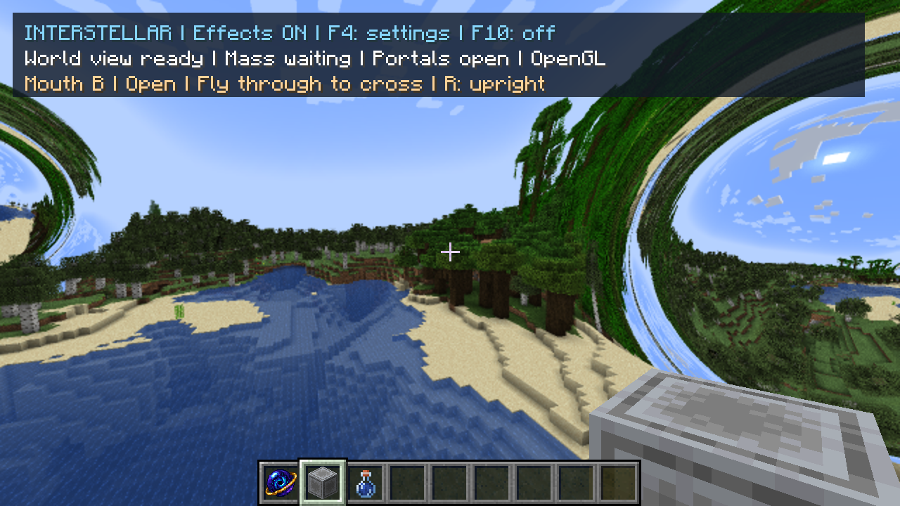

# World preparation: failure analysis and optimization

> Historical implementation report or proposal. Results, defaults and pending work describe the recorded checkpoint, not necessarily the current mod. See the [current guides and status](README.md).

## Result

The reported switch-off was a geometry-storage failure, not a shader compilation
failure. The failing world contains more native terrain than the old renderer
could store. Scheduling also repeatedly rebuilt distant changes while uncaptured
terrain waited, making preparation take minutes.

The new path preserves native geometry, materials, lighting and optical quality.
It reuses and grows geometry storage, finishes missing terrain fairly, skips only
blocks proved to emit no native faces, and avoids building unused voxel data.

On this machine, full capture of the copied failing world took **24.5 seconds**,
with a visible passage at approximately **29 seconds**. A 1440p moving-camera test
finished capture in **23.8 seconds**, opening in approximately **28 seconds**.
Regenerating all terrain from the seed took **31.7 / approximately 33 seconds**
in the final Vulkan-free default launch. An earlier diagnostic run took
**34.6 / approximately 39 seconds**, with verbose edit diagnostics and the slower
compatibility copy path enabled.
The below-30-second target is reached in some representative cases, not guaranteed
for every new world, machine, render distance or generation workload.

## What failed

1. **Storage was too small.** The owner's first attempt ran for 204 seconds, then
   failed allocating GPU rows. A 73-second retry failed the same way. The old
   10,924-row vertex arena holds about 7.45 million triangles before chunk padding
   and fragmentation; a separate streaming guard stopped at 7 million. This
   forest/river world needs approximately 8.25 million at render distance 12.
2. **Replacement fragmented the arena.** Edited chunks always requested fresh
   space before their previous allocation was freed, even when the replacement
   would fit at the same address.
3. **Our recent edit-priority fix was too broad.** It treated distant random block
   ticks like urgent nearby edits. In the stationary baseline, 1,101 chunks had
   been published after 180 seconds, but only 3.39 million triangles were resident
   and 471 chunks were still queued. Rebuilding the same regions prevented useful
   progress elsewhere. This was a regression in the earlier latency fix.
4. **Buried stone still invoked model rendering.** JFR attributed 569 of 644
   preparation samples to `WorldMesh.advance`, 423 to native block-model rendering,
   and 252 to weighted model/weight selection. These are inclusive samples, not
   additive percentages. Native rendering eventually discarded those hidden faces,
   after doing model selection and repeated visibility work.
5. **An empty placeholder could count as prepared.** Slots created before their
   chunks arrived still counted toward local readiness. Expensive optical drawing
   began while hundreds of loaded chunks remained uncaptured, slowing the work
   needed to complete the image.

## Experiments and decisions

Complexity is relative to this codebase, from 1 (small/local) to 5 (new subsystem).
These are measured stages of a development sequence, not independent speedups
that can be multiplied together.
The final source change is **+308 net lines**:264 in runtime code/developer
diagnostics and44 in allocator tests, excluding documentation and evidence.

| Change | Complexity | Evidence | Decision |
|---|---:|---|---|
| Fair capture priority | 2 | First visible image approximately 36 → 23 seconds in copied-world runs; then exposed the old 7M-triangle guard at approximately 90 seconds | Keep; near-player edits still go first |
| Reuse/shrink/extend chunk allocations; grow storage | 3 | Dense world exceeds 8.2M triangles and remains active in GL and RTX | Keep; necessary correctness fix |
| Per-block six-face early rejection | 2 | About 36 ms capture CPU per published column; complete terrain still around 90–100 seconds in that early candidate | Replaced by the better cached version; duplicate implementation removed |
| Capture-local section occlusion masks | 2 | Capture CPU roughly halved, to about 18.5 ms/column in the next candidate; native audit proves omitted blocks emit no geometry | Keep |
| Skip obsolete voxel/distant-height capture in live mesh mode | 1 | Removes a second capture/lighting representation that the native mesh shaders do not use; comparison below | Keep, with developer reference switch |
| Wait for actual loaded local geometry before first optical frame | 1 | Full capture 56.8 → 24.5 seconds with the same cached-occlusion approach; avoids starting the heavy compositor partway through preparation | Keep; ordinary Minecraft remains visible while preparing |
| Progress includes initial local capture | 1 | Counts loaded geometry rather than placeholder entries; later portal replacements retain the local cache | Keep; percentage measures work, not time remaining |

### Ideas considered but not added

- **More aggressive capture time per frame:** potentially shorter waiting, but
  directly consumes the player's frame budget. Retain the existing 5 ms capture
  slice instead of making movement less responsive during preparation.
- **Parallel native model capture:** substantial complexity. Minecraft world
  state, render caches and model access are not an immutable worker-thread scene;
  snapshotting and invalidation would need their own design and measurements.
- **Persistent meshes on disk:** may help repeat visits, but not a brand-new world.
  Requires versioning for resources, models, lighting and world edits.
- **Distant simplified geometry / reduced capture distance:** could save much more
  work, but changes the requested image and can break curved-ray occlusion. No
  such approximation was needed for these gains, so none is enabled or shipped.
- **Increasing only the fixed arena:** would hide this particular capacity error
  while leaving fragmentation and starvation, and would reserve extra memory in
  small worlds. Grow on demand instead.

## Timing evidence

Unless stated otherwise: RTX 5070 Ti, render distance 12, fine paths, 50% ray
resolution, 4× AA, 1280×720 output. Separate JVM launches include warm-up effects;
world simulation evolves during live tests. Startup of Minecraft itself is excluded.
"Full capture" means every currently loaded required chunk has a real geometry
revision; it does not count unloaded placeholders as completed terrain. Lighting
and subsequent edits can remain queued afterward.

| Run | Full initial capture | Visible passage | Notes |
|---|---:|---:|---|
| Owner failure | Failed | Failed | 204 s attempt, 73 s retry; first attempt included 73 camera-window changes |
| Old scheduling, stationary copy | Still incomplete at 180 s | ~36 s, partial terrain | Only 3.39M triangles at 180 s |
| Fair scheduling only | Failed near 90 s | ~23 s, partial terrain | Reached the separate 7M-triangle guard |
| Per-block skip + storage fix | ~90–100 s | ~20 s, partial terrain | No capacity failure |
| Cached section masks, early drawing | 56.84 s | ~13 s, partial terrain | 609 loaded chunks, 8.245M triangles |
| Cached masks, complete initial readiness | 24.52 s | ~29 s | 609 chunks, 8.245M triangles |
| Native omission audit | 44.76 s | ~49 s | Deliberately renders every skipped block to check the proof |
| Regenerated seed, diagnostic run | 34.56 s | ~39 s | No saved region/POI/entity terrain; 8.304M triangles, verbose edit logging, forced FBO copy |
| First pearl, generated QA world, 1440p | 17.85 s | Unpaired | World had already generated before throwing; 8.300M triangles |
| Second pearl with local cache ready, 1440p | Cache retained | ~5 s | Native item throw; clear elevated landing fixture |
| Restart capture while flying, 1440p | 23.84 s | ~28 s | Six chunk boundaries out and back, 8.158M triangles at first completion |
| Final OpenGL-only build, regenerated seed | 31.69 s | ~33 s | No profiling/optimization JVM flags; 8.459M triangles, defaults exercised |

The early partial-image timings are intentionally labelled. Showing a portal
quickly while leaving distant terrain missing is not equivalent to completing
world integration. Likewise, the generated-world first-pearl result does not
include the preceding vanilla world-generation time.

## Why the skipped work is safe

The optimization does **not** remove interior terrain from the world or simplify
visible surfaces. Each incremental column capture creates its own section masks.
A block is skipped only when:

- it has a position-independent, fully opaque cube culling shape;
- it has no fluid and uses a supported native basic/weighted model;
- every weighted variant has an empty unculled quad list;
- all six neighbours have fully opaque cube culling shapes.

Under those conditions, Minecraft's own face test rejects all six directional
lists and the unculled list is empty. Unknown/custom model classes, multipart
models, dynamic bounds, fluids and exposed blocks follow the original renderer.
Content changes invalidate an in-progress capture; masks do not survive it.

The audit runs the normal model renderer even for proposed skips and throws if
the triangle count changes. It completed the full 609-chunk scene without a
mismatch: more than 17 million proposed skips had been audited near completion,
and 28.4 million over the entire audit run, including subsequent refreshes.

## Storage and resource tradeoffs

Rows retain their addresses when a chunk fits, shrinks, or can extend into adjacent
free space. Otherwise the allocator finds another range and grows the GPU arena
when necessary, within device and compact-pointer limits. No geometry is evicted
or reduced in detail to make this test fit.

GL growth copies existing texels on the GPU. OpenGL 3.2 has a framebuffer-blit
fallback. A runtime audit checked both paths with 49,140 exact floating-point bit
patterns each, including the finite bit carriers used by compact node pointers.

RTX grows its vertex buffer and updates the descriptor while retaining completed
chunk acceleration structures. Completed Vulkan acceleration-structure builds do
not retain their input vertex buffers; reuse/release follows queue completion.
See the [Vulkan build-command specification](https://docs.vulkan.org/refpages/latest/refpages/source/vkCmdBuildAccelerationStructuresKHR.html).

The observed growth was 10,924 → 16,386 vertex rows: 715,216,128 → 1,072,824,192
bytes per vertex store, approximately **341 MiB extra each for GL and RTX**.
Allocation briefly needs both old and new storage. Direct GL copies measured
roughly 31–150 ms across runs; RTX copies around 18–20 ms in incremental-growth
tests. The forced framebuffer fallback took about 441 ms in the generated-world
test. These are occasional growth stalls, not per-frame costs.

Memory is still bounded: maximum 24,576 vertex rows and 6,144 total node rows,
further limited by the device. Arbitrarily dense worlds/high render distances are
not guaranteed to fit; initial range remains limited to 16 chunks. This fixes the
reported normal 12-chunk world, not all possible resource exhaustion.

## Quality and gameplay checks

- Fully populated copied world visually inspected: terrain, water, sky and both
  wormhole mouths remain present. No unbent-background shortcut or detail reduction.
- Same-frame GL/RTX grown-world comparison: RGB MAE **0.006413/255**, one of
  921,600 pixels above 16/255 maximum-channel error. This is backend agreement,
  not an independent proof of all optical physics.
- Regenerated world after forced framebuffer growth: RGB MAE **0.022160/255**,
  135 pixels above 16/255 in complex foliage/transparency.
- Nearby placement/removal with hundreds of queued chunks published in **27.5 /
  173.7 ms**. These are measured publication times, not guaranteed input latency.
- Actual first and second pearl placement, master off/on recovery, movement during
  preparation and subsequent player passage were exercised in QA copies.
- The owner-deferred broad movement/flicker survey is still deferred; the movement
  here specifically reproduces changing capture windows during preparation.

### Isolating the unused snapshot

Re-enabling the legacy voxel/height/light capture took 9.03 seconds to produce that
snapshot, while native capture continued alongside it. This is overlapping work,
not nine seconds of independently proven end-to-end savings. That run completed
native capture in 25.31 seconds and opened at approximately 30 seconds. The change
is retained for its small implementation, removed CPU/allocation work and exact
image equivalence; no separate preparation-speed percentage is claimed for it.

An across-reload image comparison was unsuitable for equivalence: clouds and
loaded chunk populations changed. The retained diagnostic instead renders **the
same frame, camera, geometry and materials twice**, changing only the legacy
snapshot to a one-pixel placeholder set. It measured **zero changed pixels**.
Alternating 16 measured draws per variant gave median GL GPU times of 100.75 ms
with legacy data and 98.84 ms with placeholders. This shows no regression in that
check, not a promised 1.9% FPS gain.

Separate live GL checks measured 100.16 versus 102.16 ms median optical GPU time
for default versus legacy-data launches; RTX measured 4.60 versus 4.59 ms. Those
launches had slightly different terrain populations, so they are supporting
operating checks rather than a controlled whole-change regression bound. The old
failing build cannot provide an equivalent fully populated 8.3M-triangle baseline.
This work targets preparation; it does not claim faster steady-state ray tracing.

### Final verification and delivery

- Normal and optional-RTX Gradle builds pass **117 tests**, including 2,000 mixed
  allocation/replacement/growth operations with independent overlap/space checks.
- Normal artifact inspected: no optional Vulkan/backend classes or Vulkan/shaderc
  jar entries. Native OpenGL-only runtime also completed a freshly generated world
  with default preparation settings and both mouths visible.
- Runtime shaders compiled; no terrain-preview or rendering error occurred in the
  accepted runs. Existing unused-uniform warnings remain. One QA launch logged an
  unrelated HTTP 500 while looking up the offline player's profile.
- No shaders, optical equations, AA settings, render distance, force law or entity
  update cadence changed. The final source change is modest; diagnostics and tests
  are separated from the normal execution path.
- Only explicitly named QA copies were opened/edited. The original `New World`
  save, original AA work and `.idea` settings are preserved. Owner graphics and
  other configuration files are restored byte-for-byte after testing.

The branch is `codex/world-preparation`, based on `30b3bb8`. Compact timing,
quality, failure and artifact evidence is under
[profiles/2026-09-29-world-preparation](profiles/2026-09-29-world-preparation/).

Remaining practical limits: newly generated terrain can still exceed 30 seconds;
memory growth has a one-time copy cost and needs headroom; CPU/GPU and render
distance affect results. Further work should profile generation/packet readiness
and chunk capture separately before adding threading or persistent disk caches.

## Reproducing the diagnostic runs

Default launches use the accepted optimizations without extra arguments. Developer
JVM properties retain reference/audit paths:

| Property | Purpose |
|---|---|
| `interstellar.profilePreparation=true` | Capture/publication time, actual loaded completion, work counters |
| `interstellar.sectionOcclusion=false` | Original native per-block rendering |
| `interstellar.auditEnclosed=true` | Render every proposed skipped block and assert zero emitted geometry |
| `interstellar.meshOnlyPreparation=false` | Retain old voxel/height/light snapshot alongside the live native mesh |
| `interstellar.fairPreparation=false` | Previous all-edits-first queue for controlled comparison |
| `interstellar.completePreparation=false` | Previous placeholder-based initial readiness for controlled comparison |
| `interstellar.auditArenaCopy=true` | Exact GL direct/FBO copy fixture |
| `interstellar.forceFramebufferCopy=true` | Force the compatibility copy path |
| `interstellar.compareMeshSnapshots=true` | With `meshOnlyPreparation=false`, Ctrl+Alt+F12 compares full snapshot versus placeholders in the same GL frame; requires an initialized optional backend for the existing comparison harness |

The native audit is intentionally slow and should remain off during normal play.
No visual-compromise toggle was added because none of these optimizations requires
a lower-quality rendering mode.
