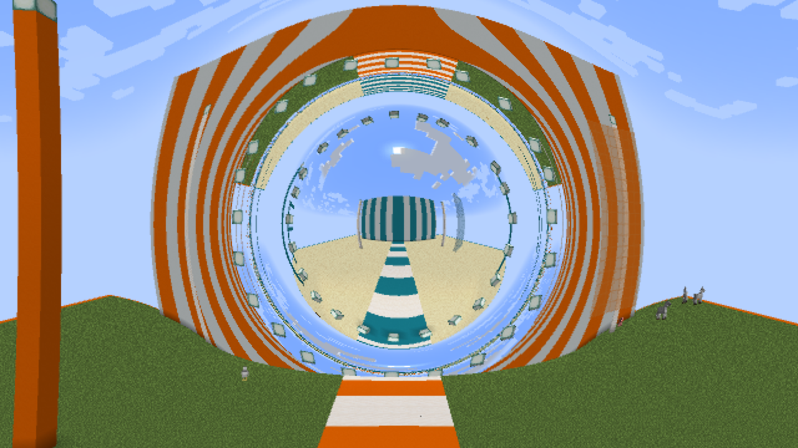

# Wormhole demo implementation — 28 September 2026

## Status

The two-mouth demo now renders Ellis light paths through real distant geometry on
both OpenGL and RTX. Player passage works in both directions, including oblique
entry with transported camera roll. The checked RTX views run at about 100–120 FPS
at 2560×1440 on the development machine. This is a hypothetical traversable metric,
not a claim that physically buildable wormholes exist.

Launch **Launch Interstellar RTX.cmd** and use `/interstellar demo wormholes`.
Wait for **World view ready**, then fly into the sphere. Alt+F12 selects RTX/OpenGL;
F10 toggles the optical view. Ordinary builds retain the OpenGL implementation with
no Vulkan backend dependencies. Evidence and limits are below.

Press **R** after a crossing to return the camera upright without moving or changing
your aim. This clears roll on both client and server. Rebind **Reset wormhole camera
tilt** under Controls → Interstellar. The HUD displays the current binding.

## Geometry and world mapping

The reference is the ultrastatic Ellis metric, documented in
[the implementation plan](overnight-goals-2026-09-28.md). Areal throat radius is16;
the isotropic-coordinate mouth radius is8 blocks. Mouth centres are
`(8,96,8)` and `(1032,112,520)`, about1145 blocks apart. The new
`interstellar:wormholes` void dimension contains19788 placed blocks. Orange grass
and cyan sandstone exhibits, asymmetric landmarks, foreground pillars, stained
glass and striped walls provide distinct finite-distance objects for optical checks.

`/interstellar demo wormholes` builds this separate exhibit once and preserves the
owner's original dimension, position, game mode and flying state. Named viewpoints:
`/interstellar demo view mouth_a|mouth_b|throat_a|throat_b`. Use
`/interstellar demo wormholes status` for native-region readiness and
`/interstellar demo leave` to return. Both physical crossing and optical activation
are automatic in this dimension. Named viewpoints reset accumulated camera roll.

## Bounded distant-world delivery

`WormholePair` defines two11×11 chunk regions. All scene blocks fit within three
chunks of their centre; two extra rings provide neighbours, native light and arrival
space. These242 retained chunks are independent of Minecraft's camera-centred
render distance. Ordinary dimensions use their existing behaviour.

`WormholeChunks` adds at most two native tickets per server tick and sends at most
two complete native chunk/light packets per tick, with a2ms send-loop budget.
Ticket propagation loads chunks asynchronously; the send loop uses the nonblocking
`ServerChunkManager.getWorldChunk(x,z)` lookup. A misleadingly named alternative,
`getChunkFutureSyncOnMainThread`, actually pumps tasks until its future completes
when invoked on the server thread, so it is deliberately avoided. A single packet
serialization can exceed the2ms slice; there is no hard real-time guarantee.

The client retains these regions in a small map owned by its `ClientChunkManager`.
Vanilla's ring buffer cannot safely hold two distant areas. Chunk and biome packet
loads use native `WorldChunk` parsing, while designated unload packets retain both
geometry data and lighting. Dimension exit releases the world/cache; server tickets
are removed when the exhibit has no players. Server block/light callbacks coalesce
bounded dirty chunk keys and resend changed chunks. No per-tick block-array scan is
introduced. Full-chunk updates are a v1 simplicity tradeoff, bounded by the send queue.

An ordered acknowledgement follows the initial packets. The client acknowledges
only after its native deferred lighting queue has applied the preceding packets and
all242 chunks exist. This is **native data readiness**, not GPU mesh readiness.
`StreamingTerrain` retains the union of both regions and the camera window, without
publishing missing designated chunks as ready empty geometry. The optical renderer
captures both ends into one retained geometry arena and RTX acceleration structure.
The HUD distinguishes preparation from the ready world view. In the tested scene,
initial native data loading and subsequent optical capture each took about 6 seconds;
first-time driver shader compilation can take considerably longer.

## Player crossing

`WormholeTravel` changes charts when the eye crosses coordinate radius8, once native
destination data is ready. It applies the tested spherical inversion and z reflection
to the eye position; the differential transports the viewing direction and up axis.
The result is converted to native yaw/pitch plus an explicit roll angle. An off-axis
crossing therefore does not silently snap the player's up axis back to vertical.

A small custom message precedes Minecraft's authoritative teleport. The client
transports its actual creative-flight velocity before vanilla clears it, then applies
it after the matching position packet. Previous-frame positions are moved into the
new chart to avoid interpolating through the1145-block map gap. Camera rotation
includes the transported roll, as does the optical shader's camera basis.
Named viewpoints reset it; returning to an ordinary dimension clears it.

These are prescribed Minecraft controls in the chosen geometry, not free-fall body
dynamics. Riding entities are excluded. General entity/projectile traversal,
arbitrary high-speed teleports and persistent roll across reconnects are not provided
by this foundation. Mouse/flight controls still use Minecraft's yaw/pitch convention;
camera roll is retained rather than replacing the full input system with a flight sim.

## Verification so far

Evidence: [runtime events](profiles/2026-09-28-wormhole-foundation/runtime-events.txt).
All runtime actions used the isolated `Interstellar Overnight Check 2026-09-28` save.

- New scene construction took about13 seconds; both native regions became ready
  about6 seconds after entry, including on re-entry. These are log timestamps,
  not a comprehensive loading benchmark.
- While at A, changed the distant B sample from sandstone to glowstone. Before
  visiting B, the client reported the new block and block light14 above it, sky15.
  Repeated from B to A after vanilla would have unloaded A. Both changes arrived;
  restored both original blocks afterwards.
- Exiting released all242 tickets. Re-entering created a new acknowledged generation
  and recovered the original blocks with normal light. Both ordinary exhibit views
  were visually inspected.
- Actual held W/S input crossed A→B and B→A. Server and client positions agree;
  client forward/backward velocities remained nonzero after transfer.
- Off-centre input crossed both ways too. First exit: yaw−48.63°, pitch−26.58°,
  roll−12.18°. The client retained the vertical component of velocity. The
  [ordinary-world screenshot](profiles/2026-09-28-wormhole-foundation/oblique-camera.png)
  confirms the camera roll. The return used a different controlled path, so it is
  not a claim of an exactly retraced geodesic or zero accumulated rotation.
- Leaving restored the original saved position and mode. Existing original worlds
  were not used for these edits; owner options were restored after normal shutdown.

The seventh Ellis test evolves the same ray from both isotropic charts, on both
sides of the throat, and checks their positions remain related by the transition.
Final optional and clean ordinary builds each pass88 tests; the ordinary jar contains
no optional RTX backend or Vulkan/shaderc classes. Two small guards
(rejecting teleport-sized velocity estimates and singular previous-position
interpolation) were added after the runtime crossing test and covered by compilation;
the ordinary measured crossings do not take those exceptional branches.

## Rendering the passage

```text
pixel + transported camera frame
                │
                ▼
Ellis Hamiltonian ray, using signed throat distance l
                │
        adaptive short chords
                │
     split exactly where l = 0
         ╱                  ╲
 mouth A coordinates    mouth B coordinates
         ╲                  ╱
    native terrain, materials and light
                │
      shared AA and reconstruction
```

The shader evolves `(l/a, radial momentum, orbital angle)` using fourth-order
Runge–Kutta. Impact parameter is conserved. Spatial curvature sets chord length
from a sagitta tolerance (the maximum distance between a curved path and its straight
chord). Independent angular and radial bounds limit the integration step. Close
views use the existing conservative quality settings; the same physical camera
must select the same accuracy when represented in either chart.

At a throat crossing, a bounded Newton solve finds the step ending at `l=0`.
The next chord begins in the other exterior. No geometry query bridges the
1,145-block map separation. Geometry candidates are assigned to their exterior
chart; a ray cannot accidentally see the distant exhibit through ordinary space.
OpenGL searches the software geometry tree; RTX hardware queries replace that
search while retaining the same optical and material source.

Remote images contain actual finite-distance surfaces. Native pillars, asymmetric
landmarks, glass and both chests therefore have parallax and occlude other surfaces;
there is no pasted destination image. Cloud meshes are captured around both mouths,
including top and bottom faces. The sky is sampled in the escaped ray's direction.
Beyond the captured geometry, larger steps integrate the remaining weak bending;
an asymptotic tail corrects the direction at `|l/a|=2048`.

Fog accumulates traversed chord distance, omitting the map gap. This gives sensible
Minecraft appearance, not a relativistic atmospheric transport model. Native block
lighting is retained, rather than recomputing illumination through the wormhole.
Both ends share the demo dimension's sky/time. The ultrastatic metric introduces
no gravitational redshift, event horizon or compulsory suction.

## Optical and rendered verification

Evidence: [metrics, events and contact sheets](profiles/2026-09-28-wormhole-optics).
All captures use the isolated overnight test save; original worlds remain untouched.

- Seven CPU tests check invariants, radial/circular rays, symmetry and reversal,
  independent elliptic-integral deflections, the transfer differential and ray paths
  represented in both charts. The complete project has 88 passing tests.
- The actual GPU diagnostic solver passes **2,575 sampled rays** against much finer
  CPU integration, including cameras inside, exactly on and outside the throat,
  both directions, and the unstable circular throat ray. Maximum direction error
  as a unit-vector difference is `4.193e-5` (approximately **0.0024°**). This validates sampled optical
  directions/end selection, not every possible ray or native material.
- The same physical camera rendered from both charts gives pixel-identical
  centreline views. The 1440p oblique pair has RGB MAE **0.000930** on a 0–1 scale;
  **0.49%** of pixels differ by more than 8 levels in a channel. Inspected images
  agree in framing, orientation and geometry; small numerical edge differences remain.
- At coordinate radius 96, the chart comparison has MAE 0.000141; comparing the
  default integration against finer angular/chord limits gives MAE 0.0000576,
  with 0.0512% of pixels differing by more than 8 levels. The far-view contact
  sheet was inspected. The analogous close-view quality switch is intentionally
  identical because close views already select the conservative limits.
- Matched 1440p GL/RTX images have RGB MAE **0.01036/255** at A,
  **0.00980/255** at B and **0.00208/255** at the oblique approach. Respectively
  689, 599 and 139 pixels exceed 16 levels in a channel, out of 3,686,400 pixels.
  Contact sheets were inspected; these are close agreement, not exact equality.
- Actual held movement crosses both ways with the optical renderer active. An
  off-axis RTX exit preserves approximately −14.25° of roll. Server/client positions
  agree and creative-flight velocity stays nonzero. Images before/after passage show
  the destination geometry continuing into the local view. Static chart comparisons
  test the coordinate switch separately from changing player position.

### Running-world performance

RTX 5070 Ti, Ryzen 5800X3D, driver 616.92; 2560×1440 output, 1280×720 logical
resolution, sharp 2× AA. Each run uses 120 warm-up frames and 300 samples. Two runs
per view; table reports median of run medians. The existing 120 FPS cap remains.

| View | Whole-frame interval | Approximate FPS | Vulkan update/render GPU |
| --- | ---: | ---: | ---: |
| Mouth A exterior | 10.10 ms | 99 | 9.05 ms |
| Mouth B exterior | 9.97 ms | 100 | 9.04 ms |
| Oblique view after returning to A | 8.85 ms | 113 | 7.97 ms |
| Off-axis exit at B | 8.32 ms | 120, capped | 4.93 ms |

Some first runs include recapture of empty chunks in the camera window after
travel; the second runs have zero queued chunks. Both populated mouth regions remain
resident throughout. Native world simulation and locally tracked actors run.
Vulkan timings exclude GL appearance copies and reconstruction; whole-frame
intervals include the live client and synchronization. These numbers apply to this
82,312-triangle exhibit, not arbitrary Minecraft terrain or other GPUs.

The frozen exterior A comparison measures about **42.0 ms OpenGL → 9.35 ms RTX**
for the optical image including synchronization/resolve, excluding live scene capture.
OpenGL remains a functioning compatibility path; equivalent 1440p performance is
not claimed.

## Deliberate v1 limits

- Two fixed mouths in a dedicated demo dimension; no general placement/pairing UI.
- Players cross; vehicles, mobs, projectiles, inventory interaction through the
  image and distant mob tracking are not implemented. Locally tracked actors can
  participate in the existing optical capture.
- Normal Minecraft controls prescribe motion; massive-body geodesics, exotic
  supporting matter and a global Einstein solution for arbitrary mouth placement
  are not simulated. Camera roll is not persisted across reconnects.
- Capture is bounded to the two designated regions; cloud/query extent is bounded
  too. Rays have a 2,048-step budget and at most four full windings; critical rays
  beyond that limit use a dark fallback. No exhausted-ray magenta was observed in
  the checked images. Broad movement/flicker testing remains deferred by the owner.
- Native illumination, fog, transparent blending and AA retain their documented
  approximations. This is physically grounded lensing in a specified hypothetical
  geometry, not a complete relativistic simulation of Minecraft.


