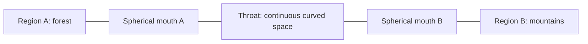
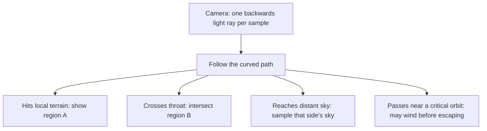

# Traversable wormholes in Interstellar: feasibility study

Status: **analysis only**, requested 28 September 2026. No wormhole gameplay or renderer
is implemented. The full-image RTX experiment remains the active implementation task.

## Recommendation

**Yes: this is a feasible and interesting next feature.** We can calculate a spherical
wormhole's lensing and the view during passage from a specified spacetime geometry.
The substantial engineering work is making two distant Minecraft regions simultaneously
visible and handling crossing, collisions and entities coherently.

The honest claim would be: **“Light propagation through a chosen hypothetical
traversable-wormhole geometry.”** It would not demonstrate that such objects exist,
can be built, or are stable with physically available matter. In classical GR, the
usual Morris–Thorne traversable models require violation of the null energy condition;
ordinary matter cannot simply be assembled into one. [Review of the energy-condition problem](https://arxiv.org/abs/2202.07431).

Block placement could create/link the two mouths as a gameplay rule. We should label
that as the rule that introduces the hypothetical geometry, rather than a simulation
of manufacturing it from realistic materials.

## What “a sphere” means

For a spherically symmetric model, the throat is a **spherical surface**, not a flat
Portal-style doorway and not a solid ball filled with another world. A throat has
area, but no requirement to have an opaque or reflective material surface. The image
comes from light travelling through the geometry.

Spherical symmetry is a choice of model, not a requirement for every possible wormhole.
It is a particularly useful choice here: clear visuals, relatively simple equations
and symmetry we can exploit computationally.

One simple model uses a signed distance `ℓ` along the passage and a throat size `a`:

`spherical cross-section radius = √(ℓ² + a²)`

Negative and positive `ℓ` label the two sides; zero labels the narrowest cross-section.
The radius never becomes zero. The coordinate continues smoothly through the throat,
which is why a renderer need not encounter a black-hole-like horizon there. This is
the ultrastatic Ellis model. Its light paths lie in planes and have conserved energy
and angular momentum, making a compact solver possible. [Ellis lensing equations](https://arxiv.org/abs/1204.3710).

This drawing shows connectivity, not a visible tube suspended between two locations:

The two mouths could be kilometres apart in ordinary Minecraft coordinates while
the route through the throat is short. They need not occupy two separate dimensions.

## What would you actually see?

**Different viewing positions would show different views of the destination.**
We would launch a ray for each pixel, follow it through the geometry, then intersect
the scene on whichever side it reaches. Moving around a mouth changes both the exit
positions and directions of those rays. A nearby tree at the destination could
occlude a mountain differently as you move; that requires real remote geometry.

There is a concrete precedent: the team behind *Interstellar* published a wormhole
ray-tracing method, adjustable geometry and camera journeys through it. Their images
include distorted remote skies and Einstein-ring behaviour. Their camera-crossing
calculations also demonstrate that a continuous transition has a mathematical basis;
the movie's artistic interior sequence is not the only possible depiction. [James, von Tunzelmann, Franklin and Thorne](https://arxiv.org/abs/1502.03809).

For our implementation, this suggests several useful demonstrations:

- Put distinct landmarks around mouth B; walk around A and watch the mapped view change.
- Position a doorway or coloured wall near B to make parallax and occlusion obvious.
- Have another player stand beside B, then walk through A to meet them.
- Throw an arrow through and watch it emerge through the linked mouth.
- Put both mouths within view and explore repeated views, subject to an explicit
  traversal budget. This last case needs more work than one isolated passage.

The central view could be recognizable and useful for navigation. Strongly distorted
or repeated images can occupy narrower regions. Their visibility depends on the
chosen geometry, mouth size and camera position; I would not promise a particular
ring thickness or an easily recognizable self-image before testing.

## How accurate could the bending be?

We can solve the chosen model's light geodesics numerically and test convergence,
just as we do for black-hole optics. The Ellis geometry even has an exact expression
for the deflection of rays that approach and return to the same asymptotic side.
That supplies an independent validation target; it does not by itself solve every
finite-distance ray through nearby Minecraft geometry. [Nakajima and Asada](https://arxiv.org/abs/1204.3710).

For nearby terrain, the renderer must follow the path through both captured scenes.
A single remote screenshot or cubemap lacks the changing ray origins needed for
correct parallax. Distant sky is a suitable use of a directional map. We should keep
that distinction explicit rather than repeat the earlier black-hole background
integration problem.

My initial model recommendation is **a stationary, nonrotating, symmetric Ellis
wormhole**, with equal-size mouths. An adjustable throat-length model could follow
if a longer transit improves the demonstration. Choosing a geometry first gives
us something precise to validate; designing a visual distortion first does not.

The recommended ultrastatic model has no position-dependent clock-rate factor.
My inference from that metric is that stationary observers do not acquire a
gravitational redshift merely by being on opposite sides, and a stationary particle
does not automatically experience a black-hole-like inward pull. Curved light paths
still occur. Observer motion can introduce Doppler shift and aberration. We should
not add compulsory suction, darkness or rainbow colours and describe them as universal
wormhole physics. [Metric and observer conventions](https://arxiv.org/abs/1502.03809).

## Can the player cross smoothly?

**Yes, for the camera; gameplay continuity is the harder part.**

I would use a coordinate for progress through the throat and a local camera frame
that evolves continuously. Minecraft's stored position would eventually switch to
the destination region, while the optical camera remains on one continuous path.
That position change is an implementation detail, not a fade or a required visual jump.

The renderer would need to preserve direction, image orientation and perceived scale
through the switch. We must define the mouth-to-mouth orientation mapping explicitly.
Changing a player's world position and rotating their yaw without matching the ray
mapping would make objects jump even if the individual images looked convincing.

For the first walkthrough I recommend creative flight, with the mouths well clear
of terrain. That allows an honest optical transit without pretending that vanilla
walking/collision rules already describe movement through curved space. A survival
version then needs an explicit rule for floors, collision boxes, gravity direction
and partially crossed entities. Large mouths make the first demo easier to understand.

### What a high-fidelity version would still approximate

| Layer | Possible treatment | Remaining limitation |
|---|---|---|
| Spacetime | Specify and solve a traversable metric | Hypothetical supporting matter and stability |
| Light paths | Accurate numerical geodesics, including crossing | Finite step, image resolution and winding budgets |
| Terrain | Actual geometry and appearance from both regions | Finite capture range and native material coverage |
| Camera | Continuous local observer frame | Player controls prescribe motion rather than a full body dynamics model |
| Moving objects | Current snapshots on both sides initially | Exact delayed images would require scene history |
| Mouth placement | Link two chosen Minecraft locations | Not a global Einstein-equation solution for the entire voxel world |

The last point matters: an isolated two-ended spherical metric is not automatically
a complete metric for two arbitrary holes in one shared Minecraft exterior. We need
a defined mapping of the two local regions into the game world. A practical model
could match to ordinary space outside a controlled region, or use a bounded
approximation whose error we measure. Both are modelling decisions to document.

## Where the development effort goes

These are engineering estimates, not timings or a commitment to implement. Difficulty
runs from 1 (small, routine work) to 5 (substantial new infrastructure).

| Piece | Difficulty | Existing work we can reuse | Main new work |
|---|---:|---|---|
| Wormhole geodesics and reference tests |3| Integrator/testing conventions, observer-frame code | New metric, throat coordinate, analytic checks |
| Frozen two-region view |3–4| Native capture, materials, AA, software/RTX geometry queries | Two scene identities and coordinate mappings |
| Continuous camera passage |4| Camera/lab controls and ray validation | Continuous throat progress and frame transport |
| Remote chunk loading and updates |4| Chunk capture and invalidation mechanisms | Bounded remote subscriptions, lifecycle and memory policy |
| Player/projectile transfer |4| Server commands/entity handling | Crossing detection, pose/velocity mapping, collision policy |
| Multiplayer and entities straddling a mouth |5| Networking foundation | Tracking remote entities, split rendering and authoritative transfer |
| Looking through repeated mouth encounters |4–5| Existing bounded tracing approach | Multiple scene transitions, ordering and termination policy |

This would be much more than a shader effect, but substantially less graphics
groundwork than starting Interstellar from scratch. The solver is not the largest
uncertainty. The two-region renderer and gameplay boundary are.

A remote destination also may not be loaded or sent to the player by vanilla
networking. We would need to arrange both server-side chunk availability and the
client data needed for rendering. A global chunk loader would be an unacceptable
default; loading must be bounded and released when no viewer needs it.

## Expected performance shape

No trustworthy FPS estimate is possible yet. Likely costs are:

- Geometry and appearance storage for two useful regions instead of one. Shared
  texture assets need not be duplicated, but geometry and local lighting can differ.
- Ray work on both sides for pixels that see through the throat.
- Extra path length near critical directions and any repeated mouth encounters.
- Remote chunk/entity maintenance, independent of ray tracing.

A distant mouth occupying little of the screen offers an opportunity to restrict
expensive work to a conservative area. The lensing around it extends beyond the
visible destination image, so a tight sphere-only mask would omit real effects.
Near or inside the throat, much of the viewport may need the full calculation.

The optical model's symmetry may support precomputed path tables. RTX, if our
complete-image experiment succeeds, could accelerate geometry searches on both
sides. Neither requires making wormholes RTX-only: the proposed backend boundary
can retain a software path. Whether that path is fast enough at a chosen range and
resolution must be measured.

## A sensible sequence, if we choose to pursue it

1. **Optics lab:** two diagnostic skies, correct bending and a camera crossing.
   Validate symmetry, ray reversal, constants of motion and known deflection limits.
2. **Frozen Minecraft pair:** two nearby captured regions, recognizable landmarks,
   correct finite-distance parallax and lighting. Compare against a slow reference.
3. **Guided fly-through:** preloaded destination and continuous camera; test both
   directions and off-centre entries. No loading screen hidden in a transition effect.
4. **Live gameplay pair:** bounded remote loading, authoritative player/projectile
   transfer and careful collision handling.
5. **Optional complexity:** multiplayer straddling, repeated passages, distant or
   cross-dimension destinations, and delayed-light history.

I would keep the mouths stationary and synchronized initially. Moving mouths and
time offsets lead to causality questions, rather than merely another rendering
parameter; that connection is described by [Morris, Thorne and Yurtsever](https://journals.aps.org/prl/abstract/10.1103/PhysRevLett.61.1446).

**Overall:** this could combine a useful transport mechanic with an unusually clear
relativity demonstration. The appropriate promise is a convincing, testable view of
a specified hypothetical geometry, plus clearly stated Minecraft gameplay rules.
